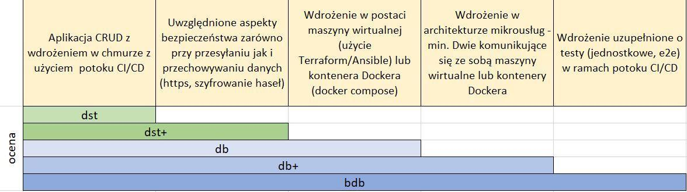

# Organizacja zajęć

Zajęcia odbywają się w trybie hybrydowym. 

Planowany program zajęć jest następujący:

| Tydzień zajęć | Temat                  | Uwagi                                    |
|---------------|------------------------|------------------------------------------|
| 1             | Zajęcia organizacyjne  |                                          |
| 2-3           | Wprowadzenie do linuxa |                                          |
| 4-5           | Azure                  |                                          |
| 6-7           | CI/CD                  | Deklaracja wyboru technologii chmurowej  |
| 8-9           | Docker                 |                                          |
| 10-11         | Ansible                |                                          |
| 12-13         | Terraform              |                                          |
| 14-15         | Prezentacja projektów  |                                          |

## Materiały

Niniejszy skrypt zawiera najważniejsze zagadnienia realizowane podczas zajęć. W celu uzupełnienia wiedzy można sięgnąć do następujących zasobów:

- [Introduction to Cloud Infrastructure Technologies](https://trainingportal.linuxfoundation.org/courses/introduction-to-cloud-infrastructure-technologies)

- [Microsoft Learn](https://learn.microsoft.com/pl-pl/training/)

## Zaliczenie

Na zaliczenie należy przygotować projekt grupowy polegający na przygotowaniu wdrożenia wybranej aplikacji w wybranej technologii chmurowej. Ocenie podlega sprawozdanie z przeprowadzonego wdrożenia. W połowie semestru studenci dokonują deklaracji wybranej technologii chmurowej.

Wymagania projektowe:



Sprawozdanie z projektu ma zostać załadowane na platformę moodle. Podczas dwóch ostatnich tygodni zajęć odbędzie się prezentacja wykonanych projektów.

## Rejestracja na Azure Portal

Krok 1: Założenie konta Azure for Students
1. Otwórz: https://azure.microsoft.com/en-us/free/students/
2. Kliknij **"Start Free"** (lub coś podobnego)
3. Zaloguj się kontem uczelnianym

❗ **Nie potrzeba karty kredytowej!**

Krok 2: Pierwsze kroki w Azure Portal
1. Otwórz: **https://portal.azure.com**
2. Zaloguj się tym samym kontem

Krok 3: Sprawdzenie subskrypcji
1. W wyszukiwarce wpisz: **"Subscriptions"**
2. Kliknij na swoją subskrypcję **"Azure for Students"**
3. Zobacz swoje 100$ (lub €) kredytów

### Instalacja Azure-CLI

```bash
# instalacja azure-cli na macOS
brew update
brew install azure-cli

# lub na windows
winget install --exact --id Microsoft.AzureCLI

# Zweryfikuj instalacje
az version

# Zaloguj do Azure
az login

# Zaloguj się w otwartym oknie przeglądarki i wybierz subskrypcje w terminalu
```

### GitHub Developer Pack

❗ **Wymagana wazna legitymacja legitymacja!**\
❗ **Wymaganay telefon!**\
❗ **Weryfikacja moze zająć do dwóch tygodni!**

1. Otwórz: https://education.github.com/pack
2. Kliknij **"Sign Up for Student Developer Pack"** (lub coś podobnego)
3. Zaloguj się do prywatnego konta GitHub (lub załóż jeśli nie masz)
4. Idź do ***Emails** pod sekcją **Access**
5. W **Add email address** dodaj email uczelniany
6. Przejść do **Payment information** pod **Billing and licensing**
7. Wypełnić swój adres w **Billing information** (nie trzeba podawać karty ale wniosek będzie odrzucony jak nie będzie adresu)
8. Przejść do **Password and authentication** pod **Access** i wybrać **enable two-factor authentication** (wniosek będzie odrzucony jak tego nie będzie)
9.  Uzyć telefonu i jakiejś aplikacji (np. Microsoft Authenticator - ja używam "Passwords" na iphonie)
10. Wybierz **Education benefits** pod sekcją **Access** -> **Billing and licensing**
11. Wybierz **Start an application**
12. Wypełnij formularz:
    1.  Select your role
    2.  Name of your school (University of Silesia in Katowice)
    3.  School email address (***@us.edu.pl)
13. Kontynuuj zgodnie z instrukcjami (jest możliwość dodania tylko jednego zdjęcia legitymacji, zatem trzeba zrobić zdjęcie przodu i tyłu i skleić je razem)
14. Po złożeniu wniosku trzeba czekać, może to zająć tydzień lub dwa ale trzeba obserwować czy nie zostanie odrzucony
15. UWAGA! Zauważyłem błąd na GitHub. Jeśli aplikacja zostanie odrzucona (a bardzo możliwe, ze będzie) to nie można rozpocząć nowej. W takim wypadku warto spróbować zmienić zdjęcie swojej legitymacji - zrobić nowe np. w pionie zamiast w poziomie)
16. Po zaakceptowaniu zainstalować Visual Studio Code
17. Zalogować się do konta na GitHub przez VS Code (w lewym dolnym rogu)
18. Zainstalować dodatek **GitHub Copilot Chat** (wyszukać w **Extensions** po lewej)
19. Warto nauczyć się Copilota tutaj: https://learn.microsoft.com/en-us/training/paths/copilot/?source=recommendations

