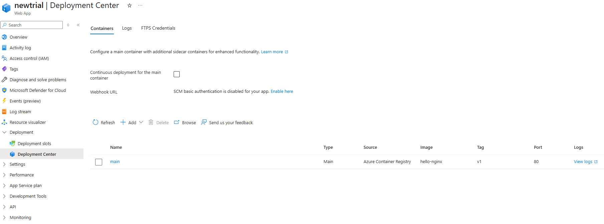
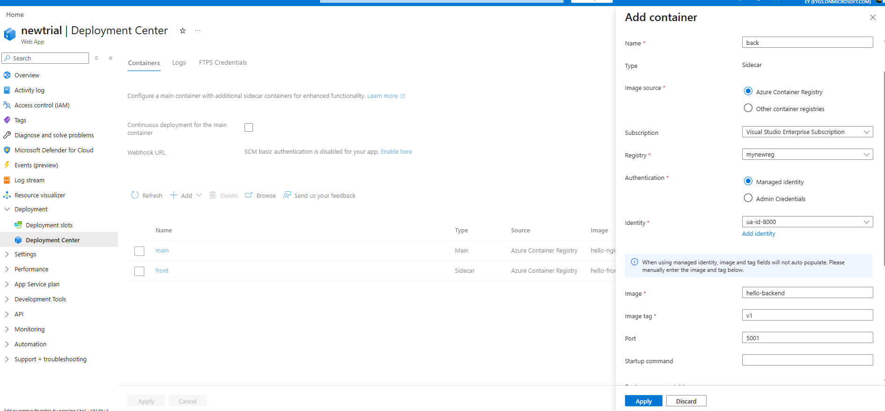
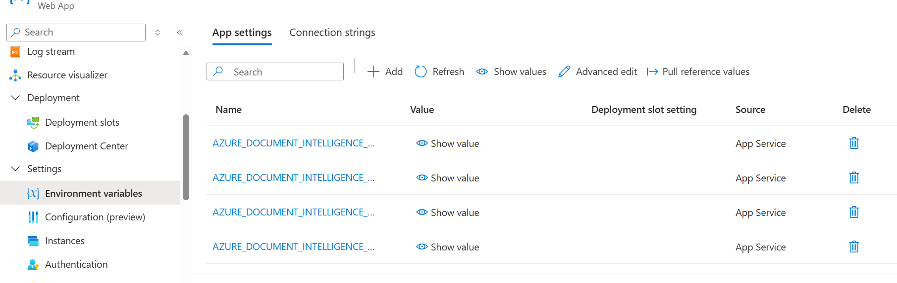

# Microsoft Azure - część 1

Autor: Bartosz Szóstak

## Cel zajęć
- Wprowadzenie do platformy Microsoft Azure (Portal + CLI)
- Praktyczna nauka tworzenia zasobów w chmurze
- Zrozumienie modelu rozliczeń i wykorzystanie darmowych usług
- Przegląd usług Azure przydatnych w projekcie końcowym

---

## 1. Wprowadzenie do Microsoft Azure

### Co to jest chmura obliczeniowa?

#### Definicja
- **Chmura obliczeniowa (Cloud Computing):** Dostęp do zasobów IT przez internet
  - Serwery, bazy danych, storage, sieci
  - Nie potrzebujesz własnego data center
  - Wszystko dostępne "na żądanie" (on-demand)

#### Model biznesowy przejście z CapEx na OpEx

**CapEx → OpEx** to zmiana modelu finansowania IT przy przejściu do chmury:

**CapEx (Capital Expenditure)** - Wydatki kapitałowe/inwestycyjne:

- Duże, jednorazowe inwestycje w infrastrukturę
- Kupujesz serwer za 10,000 PLN (on-premise)
- Musisz zapłacić od razu, przed użyciem
- Aktyw amortyzuje się przez lata (3-5 lat)

**OpEx (Operational Expenditure)** - Wydatki operacyjne:

- Regularne, miesięczne koszty za użytkowanie
- Płacisz ~$7/miesiąc za godziny użycia
- Wydatek rozliczany bieżąco
- Zatrzymujesz gdy nie używasz = 0 PLN
- Zalety przejścia CapEx → OpEx:

✅ Brak dużej początkowej inwestycji\
✅ Lepszy cash flow (rozłożone płatności)\
✅ Elastyczność - płacisz tylko za to, czego używasz\
✅ Azure dba o hardware, energię, aktualizacje\
✅ Idealne dla startupów i projektów (nie musisz wydawać dziesiątek tysięcy na start)

#### Kluczowe zalety

**1. Brak początkowych inwestycji (CapEx → OpEx)**
- Nie musisz kupować serwerów
- Nie musisz budować data center
- Zaczniesz od razu, bez czekania na dostawy sprzętu

**2. Elastyczne skalowanie**
- **Skalowanie w górę:** Więcej użytkowników? Dodaj zasoby w 2 minuty
- **Skalowanie w dół:** Mniejszy ruch? Zmniejsz koszty
- **Przykład:** Black Friday - zwiększ serwery, potem wróć do normy

**3. Globalny zasięg**
- Azure ma serwery w **60+ krajach**
- Twoja aplikacja może działać blisko użytkowników
- Polska → Poland Central (Warszawa)
- USA → East US (Virginia)

**4. Pay-as-you-go (płać za użycie)**
- Uruchomiłeś serwer na 2 godziny? Płacisz za 2 godziny
- Nie używasz w nocy? Wyłącz i nie płać
- Idealne dla projektów, testów, startupów

**5. Wysoka dostępność i bezpieczeństwo**
- Azure gwarantuje 99.9% uptime (SLA)
- Automatyczne backupy
- Certyfikaty bezpieczeństwa (ISO, SOC, GDPR)
- Microsoft inwestuje miliardy w zabezpieczenia


## ⚠️ Wady modelu OpEx (chmura obliczeniowa)

### 💸 **1. Koszty mogą wymknąć się spod kontroli**
- Łatwo zapomnieć o włączonych zasobach
- Brak limitu wydatków → potencjalnie nieskończone rachunki
- Dla długoterminowego, stabilnego użycia może być drożej niż własny serwer

### 📊 **2. Nieprzewidywalny budżet**
- Zmienne koszty miesięczne (trudniej planować)
- Nagłe spike'i ruchu = nagłe rachunki
- Brak jednorazowej płatności jak w CapEx

### 🔒 **3. Uzależnienie od dostawcy (Vendor Lock-in)**
- Trudna migracja między chmurami (Azure ↔ AWS ↔ GCP)
- Usługi specyficzne dla platformy
- Wysokie koszty transferu danych OUT

### 🌐 **4. Zależność od internetu i dostawcy**
- Brak internetu = brak dostępu do aplikacji
- Awaria Azure = Twoja aplikacja nie działa
- Opóźnienia sieciowe (latency)

### 🔐 **5. Mniejsza kontrola nad danymi**
- Dane fizycznie u Microsoft
- Ryzyko wycieku (choć rzadkie)
- Niektóre branże wymagają on-premise (wojsko, służby)

### ⚡ **6. Wydajność nie zawsze lepsza**
- Współdzielone zasoby ("noisy neighbors")
- Ograniczenia CPU w podstawowych tierach (B-series)
- Dla GPU/CPU-intensive tasks własny sprzęt może być lepszy

### 📚 **7. Krzywa uczenia się**
- Musisz nauczyć się Azure/AWS/GCP
- Stale zmieniające się usługi
- Konieczność certyfikacji dla zaawansowanego użycia

---

**💡 Punkt zwrotny:** Dla stabilnego użycia 24/7 przez ~2-3 lata własny serwer może być tańszy niż chmura.

---

### Co to jest Microsoft Azure?

#### Podstawowe informacje
- **Platforma chmurowa Microsoft** uruchomiona w 2010 roku
- **Jedna z wielkiej trójki:** AWS (Amazon), Azure (Microsoft), GCP (Google)
- Ponad **200+ usług** - od prostego hostingu po AI i machine learning
- **60+ regionów** na całym świecie (więcej niż konkurencja)

#### Globalna infrastruktura
- **Region Poland Central** - fizyczne data center w Warszawie!
- Każdy region = zestaw data centers (minimum 3 dla redundancji)
- **Availability Zones** - niezależne budynki w regionie
- Jeśli jeden data center upadnie → ruch przełącza się automatycznie

#### Kto używa Azure?
- **95% firm z Fortune 500** [źródło](https://azure.microsoft.com/pl-pl/resources/cloud-computing-dictionary/what-is-azure)
- W Polsce: mBank, Ministerstwo Finansów, Polpharma, Grupa Tauron, Żabka [źródło](https://news.microsoft.com/pl-pl/2023/04/26/microsoft-uruchomil-w-polsce-pierwszy-region-przetwarzania-danych-otwierajac-nowe-mozliwosci-rozwoju-gospodarki-cyfrowej/)
- Administracja publiczna (wymóg przechowywania danych w Polsce) [źródło](https://news.microsoft.com/pl-pl/2023/04/26/microsoft-uruchomil-w-polsce-pierwszy-region-przetwarzania-danych-otwierajac-nowe-mozliwosci-rozwoju-gospodarki-cyfrowej/)
- Miliony deweloperów na całym świecie

#### Dlaczego Azure jest popularny?
- **Integracja z Microsoft:** Windows, Office 365, Teams, GitHub
   - [Microsoft Learn – Integracja Azure z Microsoft 365](https://learn.microsoft.com/pl-pl/microsoft-365/enterprise/azure-integration?view=o365-worldwide) 
  - [One Greeneris – Azure i Microsoft 365](https://one.greeneris.com/microsoft-azure-i-microsoft-365-idealne-polaczenie-dla-nowoczesnych-firm/) 
  - [Microsoft Learn – Integracja Azure z GitHub](https://learn.microsoft.com/pl-pl/azure/developer/github/) 
  - [Microsoft Learn – Integracja Azure AD z Microsoft 365](https://learn.microsoft.com/pl-pl/microsoft-365/enterprise/microsoft-365-integration?view=o365-worldwide) 
- **Hybryda:** Łączenie chmury z własnymi serwerami (Azure Hybrid)
  - [Microsoft Azure – Rozwiązania hybrydowe](https://azure.microsoft.com/pl-pl/solutions/hybrid-cloud-app) 
  - [Microsoft Azure – Chmura hybrydowa i wielochmurowa](https://azure.microsoft.com/pl-pl/overview/azure-hybrid/) 
  - [Microsoft Learn – Azure Arc](https://learn.microsoft.com/pl-pl/azure/azure-arc/servers/quick-enable-hybrid-vm) 
  - [Lemon Pro – Chmura hybrydowa w praktyce](https://lemonpro.com/blog/chmura-hybrydowa-w-praktyce-jak-polaczyc-lokalne-serwery-z-azure/) 
- **Narzędzia dla developerów:** Visual Studio, VS Code, GitHub Actions
  - [Visual Studio – Integracja z Azure i GitHub](https://visualstudio.microsoft.com/pl/) 
  - [Microsoft Azure – Visual Studio](https://azure.microsoft.com/pl-pl/products/visual-studio) 
  - [Microsoft Learn – Visual Studio i GitHub](https://visualstudio.microsoft.com/pl/vs/github/) 
  - [Microsoft Learn – Narzędzia deweloperskie dla JavaScript](https://learn.microsoft.com/pl-pl/azure/developer/javascript/node-azure-tools) 
  - [Microsoft Learn – Programowanie na Azure z Visual Studio](https://learn.microsoft.com/pl-pl/visualstudio/azure/overview?view=vs-2022) 
  - [Microsoft Learn – Wybieranie środowiska deweloperskiego](https://learn.microsoft.com/pl-pl/devops/develop/selecting-development-environment) 
- **Enterprise-friendly:** Duże firmy lubią ekosystem Microsoft
  - [Chmura Microsoft – Bezpieczeństwo i korzyści dla firm](https://www.chmuramicrosoft.pl/microsoft-azure-2/) 
  - [Microsoft Azure – Czym jest Azure?](https://azure.microsoft.com/pl-pl/resources/cloud-computing-dictionary/what-is-azure) 
  - [Senetic – Dlaczego warto wybrać Azure?](https://www.senetic.pl/blog/3836,microsoft-azure-w-firmie-dlaczego-warto/) 
  - [BiznesTime – Microsoft Azure dla firm](https://biznestime.pl/microsoft-azure-cyfrowa-chmura-dla-firmy-dlaczego-warto-wybrac-ms-azure/) 
  - [Microsoft Azure – Porównanie z AWS](https://azure.microsoft.com/pl-pl/pricing/azure-vs-aws) 
  - [Antyweb – Microsoft dla korporacji](https://antyweb.pl/microsoft-dla-korporacji-wykorzystanie-potencjalu-m365-i-azure) 


---

### Modele usług w chmurze (wyjaśnienie)


#### 1️⃣ **IaaS** (Infrastructure as a Service) 

**Co dostajesz:**
- Wirtualne maszyny (Virtual Machines)
- Sieci (Virtual Networks)
- Storage (dyski, blob storage, bazy danych)
- Load balancers

**Ty zarządzasz:**
- ✅ System operacyjny (Linux/Windows)
- ✅ Instalacja oprogramowania
- ✅ Aplikacje
- ✅ Dane
- ✅ Bezpieczeństwo OS (patche, updates)

**Azure zarządza:**
- ❌ Fizyczne serwery
- ❌ Sieci fizyczne
- ❌ Data center

#### **Przykłady **IaaS** (Infrastructure as a Service) w Azure:**

- **Virtual Machines (VM)**

  - **Do czego służy:**   
    - Uruchamianie aplikacji wymagających pełnej kontroli nad systemem operacyjnym
    - Hosting legacy software (stare systemy, które nie działają w PaaS)
    - Serwery gier, aplikacje wymagające GPU
    - Development/testing environments

  - **Kiedy stosować:**
    - Musisz zainstalować specyficzne oprogramowanie (np. Oracle Database, SAP)
    - Migrujesz aplikację z własnego data center (lift-and-shift)
    - Potrzebujesz dostępu root/admin

  - **Jak wygląda używanie:**
    - Wybierasz rozmiar VM (CPU, RAM, dysk)
    - Instalujesz i konfigurujesz system jak na fizycznym serwerze
    - Zarządzasz wszystkim: updates, security patches, backupy
    - Płacisz za czas działania (nawet gdy VM jest "stopped" - płacisz za dysk!)

- **Virtual Networks (VNet)**
  - **Do czego służy:**
    - Tworzenie izolowanej sieci prywatnej w Azure
    - Bezpieczna komunikacja między zasobami (VM ↔ VM, VM ↔ Database)
    - Segmentacja aplikacji (frontend/backend/database w osobnych podsieciach)

  - **Kiedy stosować:**
    - Masz więcej niż jeden zasób i chcesz by komunikowały się prywatnie
    - Chcesz ograniczyć dostęp z internetu (tylko wybrane porty public)
    - Łączysz Azure z własnym data center (VPN/ExpressRoute)

  - **Jak wygląda używanie:**
    - Definiujesz przestrzeń adresową (np. 10.0.0.0/16)
    - Tworzysz podsieci (np. 10.0.1.0/24 dla frontendów, 10.0.2.0/24 dla bazy)
    - Przypisujesz zasoby do podsieci
    - Konfigurujesz NSG (firewall rules) - kto może się komunikować

- **Azure Disk Storage**
  - **Do czego służy:**
    - Dyski dla Virtual Machines (jak dysk twardy w laptopie)
    - Przechowywanie systemu operacyjnego i danych aplikacji
    - Snapshoty/backupy dysków

  - **Kiedy stosować:**
    - Każda VM musi mieć dysk OS (automatycznie tworzony)
    - Potrzebujesz dodatkowego miejsca na dane (data disk)
    - Chcesz wysoką wydajność I/O (Premium SSD dla baz danych)

  - **Jak wygląda używanie:**
    - Wybierasz typ: HDD (tani, wolny) vs SSD (szybki, droższy) vs Premium SSD (najszybszy)
    - Dysk "przyklejony" do VM - nie można go używać na dwóch VM jednocześnie
    - Skalowanie: zwiększasz rozmiar dysku gdy potrzebujesz więcej miejsca
    - **WAŻNE:** Płacisz za dysk nawet gdy VM jest zatrzymana (chyba że "deallocated")


#### 2️⃣ **PaaS** (Platform as a Service)

**Co dostajesz:**
- Gotowe środowisko do uruchamiania kodu
- Baza danych już skonfigurowana
- Automatyczne skalowanie
- Wbudowane monitorowanie

**Ty zarządzasz:**
- ✅ Twój kod (aplikacja)
- ✅ Dane w bazie
- ✅ Konfiguracja aplikacji

**Azure zarządza:**
- ❌ Infrastruktura
- ❌ System operacyjny
- ❌ Runtime (Node.js, Python, .NET)
- ❌ Patche i aktualizacje
- ❌ Skalowanie (może być automatyczne)

##### **Przykłady **PaaS** (Platform as a Service) w Azure:**

- **Azure Container Registry (ACR)**
  - **Do czego służy:**
    - Prywatne repozytorium dla obrazów Docker
    - Przechowywanie własnych kontenerów (jak prywatny Docker Hub)
    - Integracja z Azure App Service, Container Instances, Kubernetes

  - **Kiedy stosować:**
    - Masz aplikację w Docker i nie chcesz publicznego repozytorium
    - Potrzebujesz szybkiego pull'owania obrazów w Azure (niskie opóźnienia)
    - Wersjonowanie obrazów (latest, v1.0, v2.0)
    - Bezpieczne przechowywanie wielokontenerowych aplikacji

  - **Jak wygląda używanie:**
    - Budujesz obraz lokalnie: `docker build -t myapp:v1 .`
    - Tagujesz dla ACR: `docker tag myapp:v1 mojeacr.azurecr.io/myapp:v1`
    - Wypychasz: `docker push mojeacr.azurecr.io/myapp:v1`
    - Azure App Service/ACI pobiera obraz bezpośrednio z ACR
    - **Basic SKU** darmowe dla studentów (wystarczy do projektu)

---

- **Azure Blob Storage**
  - **Do czego służy:**
    - Przechowywanie plików: obrazy, PDF, video, backupy
    - Archiwizacja danych (Cold/Archive tier za grosze)

  - **Kiedy stosować:**
    - Użytkownicy uploadują pliki (zdjęcia profilowe, załączniki)
    - Przechowywanie logów aplikacji

  - **Jak wygląda używanie:**
    - Tworzysz **Storage Account** (kontener dla wszystkich danych)
    - W środku tworzysz **Blob Container** (folder logiczny)
    - Upload przez Azure Portal / CLI / SDK w kodzie
    - Generujesz URL: `https://mojestorage.blob.core.windows.net/obrazy/foto.jpg`
    - **Tiers:** Hot (często czytane) / Cool (rzadko) / Archive (prawie nigdy)
    - Dostęp: publiczny (każdy widzi) / prywatny (tylko z kluczem/SAS token)

---

- **Azure Database for PostgreSQL/MySQL**
  - **Do czego służy:**
    - Zarządzana relacyjna baza danych
    - Automatyczne backupy, patche bezpieczeństwa, skalowanie
    - Wysoką dostępność (99.99% SLA)

  - **Kiedy stosować:**
    - Potrzebujesz bazy SQL bez administracji serwerem
    - Chcesz automatyczne backupy i disaster recovery
    - Aplikacja wymaga PostgreSQL/MySQL (znasz SQL)
    - Nie chcesz instalować i zarządzać bazą na VM

- **Jak wygląda używanie:**
    - Wybierasz **Flexible Server** (nowszy, lepszy) lub Single Server
    - Konfigurujesz: rozmiar dysku, vCores, region
    - Azure automatycznie robi daily backups (retention 7-35 dni)
    - Łączysz się jak do normalnej bazy: `psql -h mydb.postgres.database.azure.com`
    - Ustawiasz **firewall rules** (kto może się łączyć)
    - Płacisz za: compute (vCPU), storage (GB), backup storage

---

- **Azure App Service (Web App)**
  - **Do czego służy:**
    - Hosting aplikacji web bez zarządzania serwerem
    - Wspiera: Node.js, Python, .NET, PHP, Java, Ruby
    - Wbudowane CI/CD, auto-scaling, HTTPS, custom domains

  - **Kiedy stosować:**
    - Masz aplikację web (REST API, MVC, SPA backend)
    - Chcesz szybki deploy z GitHub/GitLab
    - Potrzebujesz automatycznego HTTPS (Let's Encrypt)

  - **Jak wygląda używanie:**
    - Tworzysz **Web App** przypisaną do planu
    - Deploy: ZIP, Git, GitHub Actions, Docker container
    - Azure daje URL: `https://moja-app.azurewebsites.net`
    - Konfigurujesz przez Portal:
      - Environment variables (connection stringi)
      - Deployment slots (staging/production)
      - Auto-scaling rules
    - **Free tier F1:** 1GB RAM, 60 minut CPU/dzień, shared infrastruktura
    - **B1 (750h darmowe):** dedicated compute, SSL, custom domains

---

#### **Azure Key Vault**

- **Do czego służy:**
  - Bezpieczne przechowywanie sekretów (hasła, klucze API, connection stringi)
  - Zarządzanie kluczami kryptograficznymi
  - Przechowywanie certyfikatów SSL/TLS
  - Centralne miejsce dla wszystkich tajnych danych aplikacji

- **Kiedy stosować:**
  - NIE chcesz trzymać haseł w kodzie źródłowym
  - Potrzebujesz rotacji sekretów (automatyczna zmiana haseł)
  - Masz wiele aplikacji korzystających z tych samych credentials
  - Wymagania compliance (GDPR, ISO) - audit log kto i kiedy użył sekretu
  - Connection stringi do bazy danych, klucze Blob Storage, tokeny OAuth

- **Jak wygląda używanie:**
  - Tworzysz Key Vault w Azure Portal lub przez CLI
  - Dodajesz sekrety przez Portal/CLI (key-value pairs)
  - Aplikacja łączy się z Key Vault przez Azure SDK (biblioteka w kodzie)
  - Nadajesz uprawnienia aplikacji (Managed Identity) do odczytu sekretów
  - W kodzie: zamiast `password = "hardcoded123"` → `password = keyVault.getSecret("DatabasePassword")`
  - **10,000 transakcji darmowych** miesięcznie dla studentów
  - Każde pobranie sekretu = 1 transakcja (cache lokalne zalecane)
  - Audit logs: kto, kiedy i jakie sekrety pobierał

---

#### 3️⃣ **SaaS** (Software as a Service) 

**Co dostajesz:**
- Gotową aplikację
- Dostęp przez przeglądarkę
- Wszystko działa "out of the box"

**Ty zarządzasz:**
- ✅ Tylko używasz aplikacji
- ✅ Twoje dane w aplikacji
- ✅ Ustawienia użytkownika

**Dostawca zarządza:**
- ❌ Wszystko inne (infrastruktura, kod, baza, bezpieczeństwo)

**Przykłady:**
- **Microsoft 365** (Word, Excel online)
- **Gmail** - email w chmurze
- **Dropbox** - przechowywanie plików
- **Salesforce** - CRM
- **Slack** - komunikacja zespołowa

**Kiedy używać:**
- Potrzebujesz gotowego rozwiązania
- Nie chcesz nic instalować ani zarządzać
- Email, CRM, narzędzia biurowe


---

### 📊 Porównanie modeli - tabela

| Warstwa | On-Premises<br/>(Twój serwer) | IaaS | PaaS | SaaS |
|---------|------|------|------|------|
| **Aplikacje** | 👤 Ty | 👤 Ty | 👤 Ty | ☁️ Dostawca |
| **Dane** | 👤 Ty | 👤 Ty | 👤 Ty | ☁️ Dostawca |
| **Runtime** (Node, Python) | 👤 Ty | 👤 Ty | ☁️ Azure | ☁️ Dostawca |
| **Middleware** | 👤 Ty | 👤 Ty | ☁️ Azure | ☁️ Dostawca |
| **System operacyjny** | 👤 Ty | 👤 Ty | ☁️ Azure | ☁️ Dostawca |
| **Wirtualizacja** | 👤 Ty | ☁️ Azure | ☁️ Azure | ☁️ Dostawca |
| **Serwery** | 👤 Ty | ☁️ Azure | ☁️ Azure | ☁️ Dostawca |
| **Storage** | 👤 Ty | ☁️ Azure | ☁️ Azure | ☁️ Dostawca |
| **Sieć** | 👤 Ty | ☁️ Azure | ☁️ Azure | ☁️ Dostawca |

**👤 = Ty zarządzasz** | **☁️ = Dostawca zarządza**

---

### Dlaczego Azure dla tego kursu?

#### ✅ Zalety:
1. **Region w Polsce (Poland Central)**
   - Niskie opóźnienia (< 20ms)
   - Zgodność z RODO/GDPR (dane w Polsce)
   
2. **Darmowe usługi dla studentów**
   - 100€ kredytów rocznie
   - Wiele usług bez limitu czasowego
   - Bez karty kredytowej!

3. **Integracja z GitHub**
   - GitHub Actions → automatyczny deploy
   - Doskonałe dla CI/CD w projekcie

4. **Popularność**
   - Wiele firm używa Azure
   - Przydatne na rynku pracy

### ⭐ Azure for Students - Darmowe usługi


**Darmowe usługi przez cały czas studiów:**
- ✅ **750h/miesiąc** - App Service (Linux B1) - hosting aplikacji web
- ✅ **750h/miesiąc** - Virtual Machines B1s (Linux/Windows)
- ✅ **5 GB** - Blob Storage
- ✅ **250 GB** - Azure SQL Database
- ✅ **100 GB** - PostgreSQL/MySQL Database
- ✅ Azure DevOps (CI/CD pipelines)
- ✅ Azure Container Registry (Basic)
- ✅ Azure Key Vault (10,000 transakcji)

**Link:** https://azure.microsoft.com/en-us/free/students/

## 3. ĆWICZENIE 1: Zapoznanie z Azure

1. Wejdź na https://portal.azure.com/
2. Zaloguj się
3. **Zapoznaj się z interfejsem:**
   - **Lewy panel (☰)** - główne menu z usługami
     - Mozna stąd przejść do:
       - **+ Create a resource**
       - **All services** - wyszukiwarka gdzie mozna wyszukiwać usług korzystając z kategorii i filtrów
       - **Resource groups** - o tym w kolejnym ćwiczeniu ale warto wiedzieć, ze tutaj mozna sprawdzić jakie resource group'y posiada się na swoim koncie
   - **Wyszukiwarka (góra)** - szukaj usług po nazwie
   - **Cloud Shell (`>_`)** - terminal w przeglądarce (po prawej od wyszukiwarki: wyszukiwarka | copilot | Cloud Shell) - mozna tutaj korzystać np. z Azure CLI bez konieczności instalowania lokalnie. Mozna np. stworzyć projekt na GitHub, wejść w terminal Azurowy, pobrać tam projekt i pracować nad nim z wykorzystaniem Azure CLI (np. przesyłając go do VM)

4. **Azure CLI**

   **Azure CLI (Command Line Interface)** to narzędzie wiersza poleceń od Microsoft, które pozwala zarządzać zasobami Azure **bez klikania w portalu**.

    🎯 Dlaczego jest przydatne?

   1. **Automatyzacja**
      - Zamiast klikać 10 razy w portalu, napiszesz **jedną komendę**:

   2. **Szybkość**
      - Doświadczeni deweloperzy są **szybsi w terminalu** niż w graficznym interfejsie
      - Nie musisz czekać na ładowanie stron Portalu

   **Z Azure CLI mozna zrobić wszystko to samo co w Azure Portal:**
   - ✅ Tworzyć zasoby (VM, App Service, bazy danych)
   - ✅ Usuwać zasoby
   - ✅ Zmieniać konfigurację
   - ✅ Pobierać informacje (IP, status, koszty)
   - ✅ Zarządzać użytkownikami i uprawnieniami

   **Struktura:**
   ```bash
   az <grupa> <akcja> [parametry]
      │       │           │
      │       │           └─ --name, --resource-group, --location
      │       └───────────── create, delete, list, show, update
      └───────────────────── vm, webapp, storage, sql, etc.
   ```

## 3. ĆWICZENIE 2: Tworzenie grupy zasobów

### Czym jest Resource Group?
- **Logiczny kontener** dla zasobów Azure
- Wszystkie zasoby (VM, bazy, storage) muszą być w grupie
- **Łatwe zarządzanie:** usunięcie grupy = usunięcie wszystkich zasobów w niej
- **Jeden projekt = jedna grupa zasobów**

### Lokalizacja

Resource Group to tylko logiczny kontener
Resource Group ma lokalizację (np. Poland Central), ale to tylko metadane:

- Gdzie są przechowywane informacje o zasobach (metadane)
- Gdzie są logi z operacji na Resource Group
- NIE oznacza to, gdzie fizycznie działają Twoje usługi!
- Rzeczywiste zasoby mogą być w dowolnym regionie

Przykładowo:

```
Resource Group: "moj-projekt-rg" (Poland Central)
├── App Service: "moja-app" → West Europe
├── PostgreSQL: "moja-baza" → Poland Central
├── AI Foundry: "ai-model" → Sweden Central
└── Storage: "storage123" → Germany West Central
```

Wiele serwisów jest niedostępnych w Poland Central, wtedy nalezy wybrać najblizszy dostępny.

### Tworzenie RG - Wariant A: Przez Azure Portal

#### 👨‍🏫 Krok po kroku:

1. **Znajdź Resource Groups:**
   - W "Azure services" na ekranie głównym znajdź i kliknij **"Resource groups"**
   - LUB wpisz w wyszukiwarkę: `resource groups`

2. **Utwórz nową grupę:**
   - Kliknij **"+ Create"** (góra strony)
   
3. **Wypełnij formularz:**
   - **Subscription:** Azure for Students
   - **Resource group:** `technologie-chmurowe-rg`
   - **Region:** **Poland Central** 
   
4. **Utwórz:**
   - Kliknij **"Review + create"** (na dole)
   - Poczekaj na walidację
   - Kliknij **"Create"**
   
5. **Sprawdź:**
   - Poczekaj na komunikat "Deployment completed"
   - Kliknij **"Go to resource group"**

6. Zauwaz, ze RG jest puste. Tutaj mozna tworzyć zasoby pod projekt. Lepiej trzymać się zasady: jeden projekt = jedna RG.
---

### Tworzenie RG - Wariant B: Przez Cloud Shell

#### Co to jest Cloud Shell?
- Terminal dostępny w przeglądarce
- Azure CLI już zainstalowane
- Nie trzeba nic instalować lokalnie

1. **Otwórz Cloud Shell:**
   - Kliknij ikonę **`>_`** w górnym menu Azure Portal
   - Wybrać **"Settings"** -> **"Go to classic version"**
   - Jeśli pierwszy raz: wybierz **"Bash"** (a nie PowerShell)
   - Mozna wybrać **"New Session"** wtedy otworzy się w osobnym oknie
   - Azure utworzy storage dla Cloud Shell (DARMOWE)

2. **Sprawdź zalogowanie:**
```bash
az account show
```

3. **Zobacz dostępne regiony:**
```bash
az account list-locations --output table | grep -E "Poland|Europe"
```

4. **Utwórz grupę zasobów:**
```bash
az group create \
  --name <nazwa rg> \
  --location polandcentral
```

5. **Lista grup zasobów:**
```bash
az group list --output table
```

💡 **Uwaga:** Portal = wizualnie łatwiejszy, CLI = szybkie automatyzowanie

---


## 4. ĆWICZENIE 2: Deploy pierwszej aplikacji (20 min)

### 🎯 Cel: Uruchomienie prostej aplikacji web na Azure

**Co zrobimy:** Deploy statycznej strony HTML na Azure App Service (DARMOWY tier F1)

### 👨‍🏫 Wariant A: Przez Azure Portal

#### Krok 1: Przygotowanie kodu

1. **Utwórz folder lokalnie:**
```bash
mkdir azure-test-app
cd azure-test-app
```

2. **Utwórz plik `index.html`:**
```html
<!DOCTYPE html>
<html>
    <head>
        <title>Moja Pierwsza Aplikacja Azure</title>
        <style>
            body { 
                font-family: Arial; 
                text-align: center; 
                padding: 50px;
                background: linear-gradient(135deg, #667eea 0%, #764ba2 100%);
                color: white;
            }
            h1 { font-size: 48px; }
        </style>
    </head>
    <body>
        <h1>Witaj w Azure!</h1>
        <p>To jest moja pierwsza aplikacja wdrożona w chmurze.</p>
    </body>
</html>
```

3. **Zainicjuj Git:**
```bash
git init
git add .
git commit -m "Initial commit"
```

#### Krok 2: Utwórz App Service w Azure Portal

1. **Znajdź App Services:**
   - Azure Portal → wyszukaj `app services`
   - Kliknij **"+ Create"** → **"Web App"**

2. **Wypełnij formularz:**
   - **Resource Group:** `nazwa rg` (wybierz istniejącą)
   - **Name:** `nazwa apikacji` (musi być unikalna globalnie!)
   - **Publish:** Code
   - **Runtime stack:** PHP 8.2 (dla statycznego HTML)
   - **Operating System:** Linux
   - **Region:** Poland Central
   
3. **Wybierz plan cenowy (WAŻNE!):**
   - Kliknij **"Change size"** w sekcji "Pricing plans"
   - Zakładka **"Dev/Test"**
   - Wybierz **"F1" (Free)** - 0 PLN/miesiąc!


4. **Deployment:**
   - Przejdź do zakładki **"Deployment"**
   - **Continuous deployment:** Disable (na razie)
   
5. **Utwórz:**
   - **"Review + create"** → **"Create"**
   - Poczekaj ~2 minuty na deployment
   - **"Go to resource"**

#### Krok 3: Deploy kodu

**Opcja 1: GitHub**

1. **Utwórz repozytorium na GitHub:**
   - Zaloguj się na GitHub
   - Utwórz nowe repozytorium
   - Nazwa: `azure-test-app`
   - **Create repository**

2. **Wypchnij kod do GitHub:**
    ```bash
    git remote add origin https://github.com/TWOJA-NAZWA/azure-test-app.git
    git branch -M main
    git push -u origin main
    ```

3. **Pobieranie kodu z GitHub**
   - Wejdź do **"Deployment"** -> **"Deployment Center"**
   - Wybierz GitHub w **"Source"**
   - Sign in as -> **"Authorise"**
   - Wypełnij Organisation, Repository, Branch
   - Przejdź do zakładki "Logs" i poczekaj az status się zmieni
   - Wybierz "Basic authentication" w **"Authentication type"**
   - **"Save"**
   - Przejdź to **"Logs"** i zobacz czy jest sukces


4. **Zobacz swoją stronę:**
   - Przejdź do **"Overview"**
   - Kliknij **"Default domain"**
---

### 👨‍🏫 Wariant B: Przez Cloud Shell + CLI


```bash
# instalacja azure-cli na macOS
brew update
brew install azure-cli

# lub na windows
winget install --exact --id Microsoft.AzureCLI

# Zweryfikuj instalacje
az version

# Zaloguj do Azure
az login

# Zaloguj się w otwartym oknie przeglądarki i wybierz subskrypcje w terminalu

# Tworzenie App Service Plan (F1 Free)
az appservice plan create \
  --name <nazwa aplikacji> \
  --resource-group <nazwa rg> \
  --location polandcentral \
  --sku F1 \
  --is-linux

# Tworzenie Web App
az webapp create \
  --name <nazwa aplikacji> \
  --resource-group <nazwa rg> \
  --plan <nazwa planu> \
  --runtime "PHP|8.2"

# Deploy - z folderu gdzie jest projekt
az webapp up --name <nazwa aplikacji> --resource-group <nazwa rg> --runtime "PHP:8.2" --os-type linux --plan <nazwa planu>
```

---

## 5. CWICZENIE 3 - web app + backend + Azure Container Registry (ACR)

Ćwiczenie pozwoli wykorzystać Web App do deployu prostej aplikacji zawartej w trzech kontenerach: nginx, backend, frontend.

Wymaga pobrania kodu z: https://github.com/lwawrowski/technologie_chmurowe.git
Mozna uzywać terminalu w chmurze.
```bash
git clone https://github.com/lwawrowski/technologie_chmurowe.git
```

❗ **Niestety prawie na pewno nie wyjdzie :(** Na samym końcu aplikacja nie chcę się zdeplojować na subskrypcji studenckiej. Próbowałem parę razy ale za kazdym razem deploy umiera, na róznych etapach, z informacją, ze czeka w kolejce.

### 5.1 Wyczyść wszystkie zasoby w resource group

- Wyszukaj w wyszukiwarce swoją rg
- wybierz ją
- zaznacz "kwadraciki" wszystkich zasobów
- wybierz **"delete"** lub jeśli nie otworzyło się pełne okno (a pewnie nie) to symbol **"..."** po prawej stronie i wtedy **"delete"**
- napisz **"delete"** aby potwierdzić

### 5.2 lokalne uruchomienie aplikacji

```bash
# Otwórz terminal, przejdź do folderu assets/azure app/

cd assets/azure_app

# uruchom docker-compose

docker-compose up --build

# otwórz drugi terminal i sprawdź czy są trzy kontenery

docker ps

```

Wejdź w przeglądarce na http://localhost:8080 i sprawdź czy aplikacja działa

### 5.3 Utwórz Azure Container Registry

- W terminalu uzyj (mozna tez przez portal wybierająć "Create a resource" -> wyszukująć Container Registry -> Create -> Container registry -> i wypełnić formularz - ❗Uwaga: RBAC Registry Permissions oznacza, ze uprawnienia nadaje się na cały ACR a RBAC + ABAC oznacza, ze trzeba nadawać dostępy osobno na kazdy kontener. Pierwsza opcja jest praktyczniejsza.):

Znajdź w azure_app/nginx/ plik "nginx.azure.conf" i zastąp nim aktualny nginx.conf. Azure inaczej komunikuje się z kontenerami. Istotne dla niego są porty a nie nazwy kontenerów. 

```bash
bartosz@Bartoszs-MacBook-Pro azure_app % az acr create \
  --resource-group technologie-chmurowe-rg \
  --name <unikalna nazwa bez spacji i dziwnych znaków> \ 
  --sku Basic

# Zaloguj Docker do ACR
az acr login --name <nazwa ACR>

# w folderze z aplikacją utwórz obrazy (nie zapomnij uruchomic Docker Desktop)

# Budowanie z tagiem ACR
docker build -t <nazwa ACR>.azurecr.io/azure-app-backend:latest ./backend
docker build -t <nazwa ACR>.azurecr.io/azure-app-frontend:latest ./frontend
docker build -t <nazwa ACR>.azurecr.io/azure-app-nginx:latest ./nginx

# Pushowanie do ACR
docker push <nazwa ACR>.azurecr.io/azure-app-backend:latest
docker push <nazwa ACR>.azurecr.io/azure-app-frontend:latest
docker push <nazwa ACR>.azurecr.io/azure-app-nginx:latest

```

Teraz mozesz wejść w swój Resource Group, wyszukać swój Container Registry w zasobach Resource Groupy. Potem "Services" -> "Respositories" i tu powinny być widoczne wrzucone obrazy. Działa to na takiej samej zasadzie jak Docker Hub.

### 5.4 Utwórz aplikację

- Wejść w swoją RG. Wybrać **"+Create"**.
- Wyszukać **"Web App"** -> **"Create"** -> **"Web App"**
- Wypełnić formularz:
  - **"Publish"** - Contaier
-  **"Operating System"** - Linux
-  **"Linux Plan"** - "Free" lub "Basic"
-  Przejść do zakładki **"Container"**
-  **"Sidecar support"** - Wybrać jeśli nie jest
-  **"Image Source"** - "Azure Container Registry"
-  **"Name"** - to nazwa kontenera który powstanie. To ma być główny kontener jaki będzie wystawiony, zatem będzie to nginx. Nazwę wybiera się samemu, moze zostać "main".
-  **"Registry"** - nazwa ACR
-  **"Authentication"** - popularniejsze jest chyba "Managed identity" i łatwiejsze
-  **"Identity"** - mozna wybrać (New) to się automatycznie utworzy z dostępami do ACR. "Managed identity" to sztuczna tozsamość której mozna nadawać dostępy jak kazdemu uzytkownikowi. Jak się nada upwnarnienia AcrPull to apka będzie mogła zaciągać obrazy (wszytko dzieje się automatycznie).
-  **"Image"** - nazwa obrazu głównego. W tym projekcie bedzie to "azure-app-nginx"
-  **"Tag"** - w tym projekcie "latest"
-  **"Port"** - nginx nasłuchuje 80, zatem taki
-  Na końcu **"Revierw + Create"** -> **"Create"** jak ktoś będzie miał szczęście to moze zadziała...

### 5.5 Kolejne kroki

Tak wygląda "Deployment Center" w deployowanym web app:


Jest tam jeden kontener z nginx. Trzeba dodać kolejne wybierając **"+ Add"**:

Wybiera się tak samo jak wcześniej nginx. Front na porcie 8080 a back na 5000. I zrestartować apkę w overview. Następnie wejść w "Default domain", jeśli wszystko jest ok to po paru minutach pojawi się strona.


Mozna tez dodać env variables jeśli jest taka potrzeba, np. kiedy trzeba się łączyć z bazą i nie podaje się haseł w kodzie (i słusznie). Wygląda to w ten sposób:



--

## 6. Aplikacja z bazą danych i Blob Storage

Celem jest utworzenie bazy danych na Azure, Blob Storage oraz VM na której umieści się aplikację obejmującą frontend, nginx, oraz backend. Po zakończeniu, pod podanym adresem wyświetli się strona umozliwiająca przesłanie danych do bazy lub pliku pdf do Blob Storage.

### 6.1 Tworzenie bazy danych

- W portalu wyszukaj **"Azure Database for PostgradeSQL flexible servers"**
- Wybierz **"+ Create"**
- Jeśli się pokaze pytanie to wybierz: **"Quick Create"**
- Wybierz istniejącą rg, unikalną nazwę, najbliszy region
- Jeśli jest opcja wyboru **"Microsoft Entra administrator"** to wybierz siebie
- Wybierz login administratora (np. rootnewadmin), password, confirm password
- W **"Workload type"** wybierz "Dev/Test"
- Zaznacz "Add firewall rule for current IP address"
- Przejdź do Review i **"Create"**
- Wejdź do bazy -> "settings" -> "Databases"
- Utworz nową lub uzyj domyślnej "postgres"
- wypełnij .env w azure_app_2

### 6.2 Tworzenie Blob Storage

- Wyszukaj **"Storage accounts"**
- **"+ Create"**
- Wybierz aktualną rg, nadaj nazwę, najblizszy region
- **"Preffered storage type"**: Azure Blob Storage or ...
- **"Primary workload"**: Cloud native
- **"Performance"**: Standard
- **"Redundancy"**: Locally-redu...
- Przejdź do **"Networking"**
- Wybierz **"Allow public access from any Azure service within Azure to this server"** - wtedy pozwoli na połączenie z Azura np. z Web App
- Następnie wybierz: "+ Add 0.0.0.0 - 255.255.255.255" to pozwoli łączyć się z kazdego IP. Nie jest to bezpieczne, lepiej ustawić swoje IP i te którym pozawlasz na dostęp ale teraz wybierzmy wszystkie.
- Idź do "Review + create" -> **"Create"**
- Przejdź do swojego blob storage
- "Data storage" -> "Containers"
- "+ Add container"
- Nadaj nazwę -> Create
- Przejdź do "security + networking" -> "Access keys"
- Skopiuj "Storage account name" i "Key" (1 lub 2)
- wypełnij .env w azure_app_2


### 6.3 Uruchomienie lokalnie aplikacji

```bash
# Przejdź do azure_app_2 i uruchom aplikacje

cd azure_app_2

docker-compose up --build

```

- następnie przejdź do http://localhost:8080/ i wypełnij formularz oraz prześlij jakiś pdf
- Wróć do kontenera na Azure Blob Storage i zobacz swojego pdf'a
- Otwórz terminal w chmurze

```bash
# połącz się z bazą
psql "host=myservnew.postgres.database.azure.com port=5432 dbname=<nazwa mojej bazy> user=<nazwa admina> sslmode=require"

# sprawdź jakie są tabele
\dt

# i uzyj
SELECT * FROM users;

```

### 6.4 Wdrożenie aplikacji azure_app_2 na Azure VM

Teraz gdy masz już bazę danych i blob storage, możesz wdrożyć całą aplikację na jednej maszynie wirtualnej.

#### Krok 1: Tworzenie Virtual Machine

**Przez Azure CLI:**

```bash
# Utwórz VM z Ubuntu
az vm create \
  --resource-group <nazwa RG> \
  --name <nazwa VM> \
  --image Ubuntu2204 \
  --size Standard_B2s \
  --admin-username azureuser \
  --generate-ssh-keys \
  --public-ip-sku Standard

# Otwórz port 8080 (aplikacja)
az vm open-port \
  --resource-group <nazwa RG> \
  --name <nazwa VM> \
  --port 8080 \
  --priority 1001

# Pobierz publiczny adres IP i zapisz go gdzieś
az vm show \
  --resource-group <nazwa RG> \
  --name <nazwa VM> \
  --show-details \
  --query publicIps \
  --output tsv
```

**Przez Portal Azure:**

1. Wyszukaj **"Virtual machines"**
2. **"+ Create"** → **"Azure virtual machine"**
3. Wypełnij:
   - **Resource group:** `<nazwa RG>`
   - **VM name:** `<nazwa VM>`
   - **Region:** najblizszy dostępny (np. West Europe)
   - **Image:** `Ubuntu Server 22.04 LTS`
   - **Size:** `Standard_B2s` (2 vCPU, 4 GB RAM) - 750h darmowe
   - **Authentication:** SSH public key
   - **Username:** `azureuser`
4. **Networking:**
   - **Public inbound ports:** wybierz SSH (22)
5. **"Review + Create"** → **"Create"**
6. **POBIERZ klucz SSH** jeśli jest generowany
7. Po utworzeniu → **"Networking"** → **"Add inbound port rule":**
   - Port: **8080**, Priority: **1001**, Name: **Port_8080**

#### Krok 2: Połączenie z VM i instalacja Docker

```bash
# Połącz się z VM (użyj swojego IP)
ssh azureuser@<PUBLICZNY_IP>

# Na VM - aktualizuj system
sudo apt-get update
sudo apt-get upgrade -y # jak pojawi się pytanie o restartowanie to wciśnij TAB i ENTER na <OK>

# Zainstaluj Docker
sudo apt-get install -y ca-certificates curl gnupg lsb-release git

# Dodaj klucz GPG Dockera
sudo mkdir -p /etc/apt/keyrings
curl -fsSL https://download.docker.com/linux/ubuntu/gpg | sudo gpg --dearmor -o /etc/apt/keyrings/docker.gpg

# Dodaj repozytorium Docker
echo \
  "deb [arch=$(dpkg --print-architecture) signed-by=/etc/apt/keyrings/docker.gpg] https://download.docker.com/linux/ubuntu \
  $(lsb_release -cs) stable" | sudo tee /etc/apt/sources.list.d/docker.list > /dev/null

# Zainstaluj Docker Engine i Docker Compose
sudo apt-get update
sudo apt-get install -y docker-ce docker-ce-cli containerd.io docker-buildx-plugin docker-compose-plugin

# Dodaj użytkownika do grupy docker
sudo usermod -aG docker $USER
newgrp docker

# Sprawdź instalację
docker --version
docker compose version
```

   #### Krok 3: Utworzenie ACR i push obrazów

**Użycie Azure Container Registry**

Ten wariant pozwala zbudować obrazy raz lokalnie, wypchnąć do ACR i używać ich wielokrotnie.

**3.1. Utwórz Azure Container Registry:**

```bash
# Na LOKALNYM komputerze (lub w terminalu chmury)
# Utwórz ACR (Basic = darmowe dla studentów)
az acr create \
  --resource-group technologie-chmurowe-rg \
  --name <unikalna-nazwa-acr> \
  --sku Basic

# Zaloguj Docker do ACR
az acr login --name <unikalna-nazwa-acr>
```

**Przez Portal:**
- Wyszukaj **"Container registries"** → **"+ Create"**
- Wypełnij: RG, nazwa (globalnie unikalna), region, SKU: **Basic**
- **"Review + Create"** → **"Create"**

**3.2. Zaktualizuj docker-compose.azure.yml:**

```yaml
services:
  backend:
    image: <twoja-nazwa-acr>.azurecr.io/azure-app-2-backend:latest
    container_name: azure_app_backend
    env_file:
      - .env
    networks:
      - app-network

  frontend:
    image: <twoja-nazwa-acr>.azurecr.io/azure-app-2-frontend:latest
    container_name: azure_app_frontend
    networks:
      - app-network

  nginx:
    image: <twoja-nazwa-acr>.azurecr.io/azure-app-2-nginx:latest
    container_name: azure_app_nginx
    ports:
      - "8080:80"
    depends_on:
      - backend
      - frontend
    networks:
      - app-network

networks:
  app-network:
    driver: bridge
```

**3.3. Zbuduj i wypchnij obrazy do ACR:**

```bash
# Na LOKALNYM komputerze w folderze azure_app_2
cd "/Users/bartosz/projects/technologie_chmurowe/assets/azure_app_2"

# Zbuduj obrazy z tagiem ACR
# WAŻNE: --platform linux/amd64 dla kompatybilności z VM (nawet na Apple Silicon)
docker build --platform linux/amd64 -t <nazwa-acr>.azurecr.io/azure-app-2-backend:latest ./backend
docker build --platform linux/amd64 -t <nazwa-acr>.azurecr.io/azure-app-2-frontend:latest ./frontend
docker build --platform linux/amd64 -t <nazwa-acr>.azurecr.io/azure-app-2-nginx:latest ./nginx

# Wypchnij do ACR
docker push <nazwa-acr>.azurecr.io/azure-app-2-backend:latest
docker push <nazwa-acr>.azurecr.io/azure-app-2-frontend:latest
docker push <nazwa-acr>.azurecr.io/azure-app-2-nginx:latest
```

💡 **Uwaga dla użytkowników macOS (Apple Silicon):** Flaga `--platform linux/amd64` jest **konieczna**, aby obrazy działały na Linux VM w Azure!

**3.4. Włącz Admin Access w ACR (łatwiejsze logowanie z VM):**

```bash
# Włącz admin user
az acr update --name <nazwa-acr> --admin-enabled true

# Pobierz dane logowania (zapisz!)
az acr credential show --name <nazwa-acr>
```

Lub przez Portal: ACR → **"Settings"** → **"Access keys"** → Zaznacz **"Admin user"** → Skopiuj **Username** i **Password**

**3.5. Przenieś tylko pliki konfiguracyjne na VM:**

```bash
# Przenieś tylko .env i docker-compose.azure.yml
scp .env docker-compose.azure.yml azureuser@<PUBLICZNY_IP>:~/ 20.215.185.25
```

#### Krok 4: Konfiguracja na VM

```bash
# Połącz się z VM
ssh azureuser@<PUBLICZNY_IP>

# Zaloguj Docker do ACR używając admin credentials
docker login <nazwa-acr>.azurecr.io
# Username: <nazwa-acr> (lub username z kroku 3A.4)
# Password: <password z kroku 3A.4>

# Sprawdź czy docker-compose.azure.yml i .env są na VM
ls -la
```

#### Krok 5: Uruchomienie aplikacji z ACR

```bash
# Na VM - użyj docker-compose.azure.yml
docker compose -f docker-compose.azure.yml up -d

# Sprawdź status
docker compose -f docker-compose.azure.yml ps

# Zobacz logi
docker compose -f docker-compose.azure.yml logs -f
```

---


#### Krok 6: Testowanie

```bash
# Z VM
curl http://localhost:8080

# Z przeglądarki na lokalnym komputerze
# Otwórz: http://<PUBLICZNY_IP>:8080
```

#### Przydatne komendy:

```bash
# Zatrzymaj aplikację
docker compose -f docker-compose.azure.yml down

# Restart po zmianach
docker compose -f docker-compose.azure.yml restart

# Sprawdź zużycie zasobów
docker stats

# Wejdź do kontenera (debugging)
docker compose -f docker-compose.azure.yml exec backend /bin/bash

# Usuń wszystko i pobierz świeże obrazy
docker compose -f docker-compose.azure.yml down
docker compose -f docker-compose.azure.yml pull
docker compose -f docker-compose.azure.yml up -d
```

#### ⚠️ WAŻNE - Oszczędzanie kosztów:

```bash
# ZAWSZE zatrzymuj VM gdy nie używasz!
# Z lokalnego komputera:
az vm deallocate \
  --resource-group <nazwa rg> \
  --name vm-azure-app-2

# Włącz ponownie gdy potrzebujesz:
az vm start \
  --resource-group <nazwa rg> \
  --name vm-azure-app-2

# Sprawdź status i IP po włączeniu:
az vm show \
  --resource-group <nazwa rg> \
  --name vm-azure-app-2 \
  --show-details \
  --query "{Name:name, PowerState:powerState, PublicIP:publicIps}" \
  --output table
```

---

### 6.5 Azure Key Vault

Dzięki Azure Key Vault mozna tworzyć bezpieczniejsze rozwiązania. Dzięki temu rozwiązaniu nie trzeba tworzyć .env w projekcie i ryzykować przypadkowego przesłania go do repo. Zamiast teg przechowuje się wszystkie zmienne bezpiecznie w chmurze.

Informacje o tym jak działa Key Vault i jak mozna go uzywać znajdują się tutaj: https://learn.microsoft.com/en-us/azure/key-vault/general/developers-guide

## 7. Schemat rozliczeń w Azure (10 min)


### Model Pay-as-you-go (płać za użycie)
- **Płacisz tylko za uruchomione zasoby**
- Rozliczenie co godzinę lub minutę
- **ZATRZYMANA maszyna wirtualna = DALEJ PŁACISZ** (za dysk!)
- **ZWOLNIONA (deallocated) maszyna = nie płacisz**

### Co kosztuje? (Główne czynniki)

#### 1. 💻 Compute (Obliczenia)
- **Maszyny wirtualne:**
  - Im większa (więcej CPU/RAM) = drożej
  - Linux tańszy niż Windows (~30%)
  - Standard_B1s (1 vCPU, 1GB RAM) ≈ $7.5/miesiąc
- **App Service:** F1 (Free), B1 ≈ $13/miesiąc  
- **Container Instances:** ≈ $0.0000125/sekunda/vCPU

#### 2. 💾 Storage (Przechowywanie)
- Blob Storage: $0.018/GB/miesiąc (Hot tier)
- Dyski VM: $0.60-$4/miesiąc (HDD vs SSD)
- **Operacje**: zapisy/odczyty też kosztują (frakcje centa)

#### 3. 🌐 Networking (Sieć)
- **Ruch przychodzący (IN)**: DARMOWY
- **Ruch wychodzący (OUT)**: pierwszy 100GB darmowy, potem $0.087/GB
- Public IP: $0.005/godzinę

#### 4. 🗄️ Databases
- PostgreSQL: Basic tier $25-30/miesiąc
- **100 GB darmowego PostgreSQL/MySQL** w Azure for Students!

### 🎯 ĆWICZENIE: Sprawdzanie kosztów w Portal


1. **Otwórz Cost Management**
   - W Azure Portal wpisz w wyszukiwarkę i wybierz: `cost management`

2. **Zobacz aktualne koszty:**
   - W lewym menu kliknij **"Reporting + analytics"** -> **"Cost analysis"**
   - Wybierz **"all views"**
   - Wybierz widok **"Accumulated costs"**
   - Tutaj pojawi się wykres wydatków (teraz moze być ~$0 jeśli dopiero zaczynasz)
   - Zobacz mozliwe modyfikacje: Group By, Granularity, i do wyboru Area/Line/Column(stacked)/Column(grouped)/Table
   - Wybierz "+" i wybierz inny widok np. **"Services"**
   - Jeśli w trakcie pracy pojawią się koszty to będą tutaj widoczne
  
3. **Ustaw alert budżetu:**
   - **Monitoring** -> **Alerts**
   - Wybierz **"Action groups"** (na tym samym pasku co "+ Create", mniej więcej po środku)
   - **"+  Create"**
   - **Resource group** ta na której pracujemy
   - **Region** Global
   - **Action group name** np. budget-alert
   - **Display name** moze być to samo
   - **Next:notifications**
   - **Notification type** Email/SMS message/Push/Voice
   - **Email:** twój email
   - **OK**
   - **Name** np. budget-message
   - **Review + create**
   - Wróć do swojej rg
   - W lewym menu: **"Monitoring"** -> **"Budgets"**
   - **"+ Add"**
   - **Name**: np. my-budget
   - **Amount:** np.20€
   - **Next**
   - **Type** np. Actual cost
   - **% of budget** np. 80% (= 16€)
   - **Action group** utworzona

   - **Create**

### 💡 Jak oszczędzać? (WAŻNE!)

#### ⚠️ Zasady dla projektu:
1. **ZAWSZE ZATRZYMUJ VM gdy nie używasz:**
   ```bash
   az vm deallocate --resource-group <grupa> --name <vm-name>
   ```
   Portal: VM → Stop (zwolnij)

2. **USUWAJ testowe zasoby po pracy:**
   - Najłatwiej: usuń całą grupę zasobów
   
3. **Wybieraj najmniejsze instancje do testów:**
   - B1s dla VM (wystarczy do testów)
   - F1/Free tier dla App Service

4. **Używaj darmowych usług gdzie możliwe:**
   - App Service Linux B1 (750h/miesiąc darmowe)
   - Container Instances tylko do testów

5. **Monitoruj REGULARNIE:**
   - Sprawdzaj Cost Management co tydzień
   - 100 EUR kredytów = ~3-4 miesiące przy rozsądnym użyciu

---

## 7. Architektura przykładowego projektu (10 min)

### 🎯 Scenariusz: Aplikacja CRUD "TODO List" z mikrousługami

#### Wymagania projektu:
- ✅ Aplikacja CRUD
- ✅ Wdrożenie w chmurze
- ✅ CI/CD pipeline
- ✅ HTTPS + szyfrowanie haseł
- ✅ Architektura mikrousług (min 2 serwisy)
- ✅ Testy (jednostkowe + e2e)

#### Proponowana architektura (DARMOWA w Azure for Students):

```
┌─────────────────────────────────────────────────┐
│              INTERNET (HTTPS)                   │
└──────────────────┬──────────────────────────────┘
                   │
         ┌─────────▼─────────┐
         │  App Service F1   │ Frontend (React/Vue)
         │  (750h darmowe)   │ Static files
         └─────────┬─────────┘
                   │ REST API calls
         ┌─────────▼─────────┐
         │  App Service B1   │ Backend API (Node.js/Python)
         │  (750h darmowe)   │ - CRUD endpoints
         └─────────┬─────────┘ - Autoryzacja (JWT)
                   │           - Walidacja
         ┌─────────▼─────────────────┐
    ┌────┴────┐              ┌──────▼─────┐
    │ VM B1s  │              │ PostgreSQL │
    │ (750h)  │              │ (100GB)    │
    │ Worker  │              │            │
    │ Service │              │ Free tier  │
    └─────────┘              └────────────┘
    Email/tasks              User data
    
┌────────────────────┐       ┌──────────────┐
│  Blob Storage      │       │  Key Vault   │
│  (5GB darmowe)     │       │  (10k trans) │
│  - Uploaded files  │       │  - DB pass   │
└────────────────────┘       │  - JWT secret│
                             └──────────────┘

┌─────────────────────────────────────────┐
│         GitHub Actions (CI/CD)          │
│  - Run tests (unit + e2e)               │
│  - Build                                │
│  - Deploy to Azure                      │
└─────────────────────────────────────────┘
```

#### Szczegóły implementacji:

**Serwis 1: Frontend (App Service F1)**
- React/Vue SPA
- Komunikacja z Backend API przez HTTPS
- Deploy przez GitHub Actions

**Serwis 2: Backend API (App Service B1)**
- Node.js Express / Python Flask/FastAPI
- JWT autoryzacja
- Bcrypt dla haseł
- Connection do PostgreSQL przez environment variables (z Key Vault)

**Serwis 3: Worker Service (VM B1s lub Container)**
- Procesy w tle: email notifications, scheduled tasks
- Komunikacja z Backend API

**Baza danych: PostgreSQL Flexible Server**
- Free tier (100GB)
- Firewall: tylko Azure Services
- SSL/TLS wymuszony

**Bezpieczeństwo:**
- ✅ HTTPS on (App Service setting)
- ✅ Hasła w Key Vault
- ✅ Bcrypt dla user passwords
- ✅ JWT tokens
- ✅ NSG rules dla VM

**CI/CD:**
```yaml
# Etapy pipeline:
1. Trigger: git push do main
2. Run unit tests (Jest/Pytest)
3. Run e2e tests (Cypress/Playwright)
4. Build aplikacji
5. Deploy do Azure App Service
6. Health check
```
