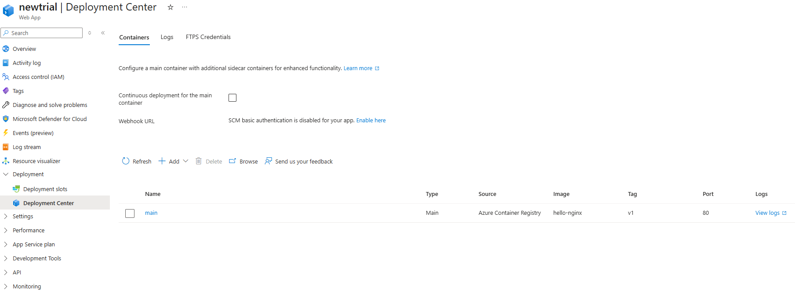

# Azure - Plan zajęć warsztatowych (90 minut)

## Cel zajęć
- Wprowadzenie do platformy Microsoft Azure (Portal + CLI)
- Praktyczna nauka tworzenia zasobów w chmurze
- Zrozumienie modelu rozliczeń i wykorzystanie darmowych usług
- Przegląd usług Azure przydatnych w projekcie końcowym


---

## 1. Wprowadzenie do Microsoft Azure (5 min)

### Co to jest chmura obliczeniowa?

#### Definicja
- **Chmura obliczeniowa (Cloud Computing):** Dostęp do zasobów IT przez internet
  - Serwery, bazy danych, storage, sieci
  - Nie potrzebujesz własnego data center
  - Wszystko dostępne "na żądanie" (on-demand)

#### Model biznesowy
- **Tradycyjnie (on-premises):**
  - Kupujesz serwer za 10,000 PLN
  - Płacisz za prąd, chłodzenie, utrzymanie
  - Serwer starzeje się, po 3-5 latach wymiana
  
- **W chmurze:**
  - Płacisz tylko za godziny użycia
  - Przykład: $0.01/godzina = ~$7/miesiąc
  - Zatrzymujesz gdy nie używasz = 0 PLN
  - Azure dba o hardware, energia, aktualizacje

#### Kluczowe zalety

**1. Brak początkowych inwestycji (CapEx → OpEx)**
- Nie musisz kupować serwerów
- Nie musisz budować data center
- Zaczniesz od razu, bez czekania na dostawy sprzętu

**2. Elastyczne skalowanie**
- **Skalowanie w górę:** Więcej użytkowników? Dodaj zasoby w 2 minuty
- **Skalowanie w dół:** Mniejszy ruch? Zmniejsz koszty
- **Przykład:** Black Friday - zwiększ serwery, potem wróć do normy

**3. Globalny zasięg**
- Azure ma serwery w **60+ krajach**
- Twoja aplikacja może działać blisko użytkowników
- Polska → Poland Central (Warszawa)
- USA → East US (Virginia)

**4. Pay-as-you-go (płać za użycie)**
- Uruchomiłeś serwer na 2 godziny? Płacisz za 2 godziny
- Nie używasz w nocy? Wyłącz i nie płać
- Idealne dla projektów, testów, startupów

**5. Wysoka dostępność i bezpieczeństwo**
- Azure gwarantuje 99.9% uptime (SLA)
- Automatyczne backupy
- Certyfikaty bezpieczeństwa (ISO, SOC, GDPR)
- Microsoft inwestuje miliardy w zabezpieczenia

---

### Co to jest Microsoft Azure?

#### Podstawowe informacje
- **Platforma chmurowa Microsoft** uruchomiona w 2010 roku
- **Jedna z wielkiej trójki:** AWS (Amazon), Azure (Microsoft), GCP (Google)
- Ponad **200+ usług** - od prostego hostingu po AI i machine learning
- **60+ regionów** na całym świecie (więcej niż konkurencja)

#### Globalna infrastruktura
- **Region Poland Central** - fizyczne data center w Warszawie!
- Każdy region = zestaw data centers (minimum 3 dla redundancji)
- **Availability Zones** - niezależne budynki w regionie
- Jeśli jeden data center upadnie → ruch przełącza się automatycznie

#### Kto używa Azure?
- **95% firm z Fortune 500**
- W Polsce: PKO BP, PZU, ORLEN, Allegro, InPost
- Administracja publiczna (wymóg przechowywania danych w Polsce)
- Miliony deweloperów na całym świecie

#### Dlaczego Azure jest popularny?
- **Integracja z Microsoft:** Windows, Office 365, Teams, GitHub
- **Hybryda:** Łączenie chmury z własnymi serwerami (Azure Hybrid)
- **Narzędzia dla developerów:** Visual Studio, VS Code, GitHub Actions
- **Enterprise-friendly:** Duże firmy lubią Microsoft ekosystem

---

### Modele usług w chmurze (wyjaśnienie)

**Wyobraź sobie pizzę 🍕:**

#### 1️⃣ **IaaS** (Infrastructure as a Service) 

**Co dostajesz:**
- Wirtualne maszyny (Virtual Machines)
- Sieci (Virtual Networks)
- Storage (dyski, blob storage)
- Load balancers

**Ty zarządzasz:**
- ✅ System operacyjny (Linux/Windows)
- ✅ Instalacja oprogramowania
- ✅ Aplikacje
- ✅ Dane
- ✅ Bezpieczeństwo OS (patche, updates)

**Azure zarządza:**
- ❌ Fizyczne serwery
- ❌ Sieci fizyczne
- ❌ Data center

**Przykład w Azure:**
- **Virtual Machines** - pełna kontrola nad VM
- **Virtual Networks** - własna izolowana sieć
- **Azure Disk Storage** - dyski dla VM

**Kiedy używać:**
- Potrzebujesz pełnej kontroli
- Legacy aplikacje (stare systemy)
- Specyficzne wymagania systemowe

---

#### 2️⃣ **PaaS** (Platform as a Service)

**Co dostajesz:**
- Gotowe środowisko do uruchamiania kodu
- Baza danych już skonfigurowana
- Automatyczne skalowanie
- Wbudowane monitorowanie

**Ty zarządzasz:**
- ✅ Twój kod (aplikacja)
- ✅ Dane w bazie
- ✅ Konfiguracja aplikacji

**Azure zarządza:**
- ❌ Infrastruktura
- ❌ System operacyjny
- ❌ Runtime (Node.js, Python, .NET)
- ❌ Patche i aktualizacje
- ❌ Skalowanie (może być automatyczne)

**Przykład w Azure:**
- **App Service** - hosting aplikacji web (Node.js, Python, PHP, .NET)
- **Azure SQL Database** - zarządzana baza SQL
- **Azure Functions** - serverless (kod bez serwera)

**Kiedy używać:**
- Chcesz skupić się na kodzie, nie na infrastrukturze
- Aplikacje webowe (REST API, frontend)
- Bazy danych bez administracji

---

#### 3️⃣ **SaaS** (Software as a Service) 

**Co dostajesz:**
- Gotową aplikację
- Dostęp przez przeglądarkę
- Wszystko działa "out of the box"

**Ty zarządzasz:**
- ✅ Tylko używasz aplikacji
- ✅ Twoje dane w aplikacji
- ✅ Ustawienia użytkownika

**Dostawca zarządza:**
- ❌ Wszystko inne (infrastruktura, kod, baza, bezpieczeństwo)

**Przykłady:**
- **Microsoft 365** (Word, Excel online)
- **Gmail** - email w chmurze
- **Dropbox** - przechowywanie plików
- **Salesforce** - CRM
- **Slack** - komunikacja zespołowa

**Kiedy używać:**
- Potrzebujesz gotowego rozwiązania
- Nie chcesz nic instalować ani zarządzać
- Email, CRM, narzędzia biurowe


---

### 📊 Porównanie modeli - tabela

| Warstwa | On-Premises<br/>(Twój serwer) | IaaS | PaaS | SaaS |
|---------|------|------|------|------|
| **Aplikacje** | 👤 Ty | 👤 Ty | 👤 Ty | ☁️ Dostawca |
| **Dane** | 👤 Ty | 👤 Ty | 👤 Ty | ☁️ Dostawca |
| **Runtime** (Node, Python) | 👤 Ty | 👤 Ty | ☁️ Azure | ☁️ Dostawca |
| **Middleware** | 👤 Ty | 👤 Ty | ☁️ Azure | ☁️ Dostawca |
| **System operacyjny** | 👤 Ty | 👤 Ty | ☁️ Azure | ☁️ Dostawca |
| **Wirtualizacja** | 👤 Ty | ☁️ Azure | ☁️ Azure | ☁️ Dostawca |
| **Serwery** | 👤 Ty | ☁️ Azure | ☁️ Azure | ☁️ Dostawca |
| **Storage** | 👤 Ty | ☁️ Azure | ☁️ Azure | ☁️ Dostawca |
| **Sieć** | 👤 Ty | ☁️ Azure | ☁️ Azure | ☁️ Dostawca |

**👤 = Ty zarządzasz** | **☁️ = Dostawca zarządza**

---

### 🎯 Który model wybrać dla projektu?

**Dla projektu końcowego polecamy PaaS (App Service):**
- ✅ Szybkie wdrożenie
- ✅ Wbudowane CI/CD z GitHub
- ✅ Automatyczne HTTPS (certyfikat SSL)
- ✅ Darmowy tier F1 + 750h/mies B1
- ✅ Skupiasz się na kodzie, nie na serwerach

**IaaS (Virtual Machines) jeśli:**
- Potrzebujesz specyficznego softwaru
- Chcesz pełnej kontroli
- Uczysz się administracji serwerami

**Przykład decyzji:**
- **Frontend (React):** PaaS (App Service) lub SaaS (GitHub Pages)
- **Backend API (Node.js):** PaaS (App Service) 👈 **POLECANE**
- **Baza danych:** PaaS (Azure PostgreSQL) 👈 **POLECANE**
- **Worker/Background tasks:** IaaS (VM) lub PaaS (Azure Functions)


### Dlaczego Azure dla tego kursu?

#### ✅ Zalety:
1. **Region w Polsce (Poland Central)**
   - Niskie opóźnienia (< 20ms)
   - Zgodność z RODO/GDPR (dane w Polsce)
   
2. **Darmowe usługi dla studentów**
   - 100$ kredytów rocznie
   - Wiele usług bez limitu czasowego
   - Bez karty kredytowej!

3. **Integracja z GitHub**
   - GitHub Actions → automatyczny deploy
   - Doskonałe dla CI/CD w projekcie

4. **Popularność**
   - Wiele firm używa Azure
   - Przydatne na rynku pracy

### ⭐ Azure for Students - Darmowe usługi

**Kredyty:**
- **100$ na 12 miesięcy** (odnawialnych rocznie!)
- **Bez karty kredytowej**

**Darmowe usługi przez cały czas studiów:**
- ✅ **750h/miesiąc** - App Service (Linux B1) - hosting aplikacji web
- ✅ **750h/miesiąc** - Virtual Machines B1s (Linux/Windows)
- ✅ **5 GB** - Blob Storage
- ✅ **250 GB** - Azure SQL Database
- ✅ **100 GB** - PostgreSQL/MySQL Database
- ✅ Azure DevOps (CI/CD pipelines)
- ✅ Azure Container Registry (Basic)
- ✅ Azure Key Vault (10,000 transakcji)

**Link:** https://azure.microsoft.com/en-us/free/students/

## 2. ĆWICZENIE 1: Tworzenie grupy zasobów (10 min)

### Czym jest Resource Group?
- **Logiczny kontener** dla zasobów Azure
- Wszystkie zasoby (VM, bazy, storage) muszą być w grupie
- **Łatwe zarządzanie:** usunięcie grupy = usunięcie wszystkich zasobów w niej
- **Jeden projekt = jedna grupa zasobów**

### Lokalizacja

Resource Group to tylko logiczny kontener
Resource Group ma lokalizację (np. Poland Central), ale to tylko metadane:

- Gdzie są przechowywane informacje o zasobach (metadane)
- Gdzie są logi z operacji na Resource Group
- NIE oznacza to, gdzie fizycznie działają Twoje usługi!
- Rzeczywiste zasoby mogą być w dowolnym regionie

Przykładowo:

```
Resource Group: "moj-projekt-rg" (Poland Central)
├── App Service: "moja-app" → West Europe
├── PostgreSQL: "moja-baza" → Poland Central
├── AI Foundry: "ai-model" → Sweden Central
└── Storage: "storage123" → Germany West Central
```

Wiele serwisów jest niedostępnych w Poland Central, wtedy nalezy wybrać najblizszy dostępny.

### Wariant A: Przez Azure Portal

#### 👨‍🏫 Krok po kroku:

1. **Znajdź Resource Groups:**
   - W wyszukiwarce znajdź i kliknij **"Resource groups"**
   - LUB wpisz w wyszukiwarkę: `resource groups`

2. **Utwórz nową grupę:**
   - Kliknij **"+ Create"** (góra strony)
   
3. **Wypełnij formularz:**
   - **Subscription:** Azure for Students
   - **Resource group:** `technologie-chmurowe-rg`
   - **Region:** **Poland Central** 
   
4. **Utwórz:**
   - Kliknij **"Review + create"** (na dole)
   - Poczekaj na walidację
   - Kliknij **"Create"**
   
5. **Sprawdź:**
   - Poczekaj na komunikat "Deployment completed"
   - Kliknij **"Go to resource group"**

---

### Wariant B: Przez Cloud Shell

#### Co to jest Cloud Shell?
- Terminal dostępny w przeglądarce
- Azure CLI już zainstalowane
- Nie trzeba nic instalować lokalnie

1. **Otwórz Cloud Shell:**
   - Kliknij ikonę **`>_`** w górnym menu Azure Portal
   - Wybrać **"Settings"** -> **"Go to classic version"**
   - Jeśli pierwszy raz: wybierz **"Bash"** (a nie PowerShell)
   - Mozna wybrać **"New Session"** wtedy otworzy się w osobnym oknie
   - Azure utworzy storage dla Cloud Shell (DARMOWE)

2. **Sprawdź zalogowanie:**
```bash
az account show
```

3. **Zobacz dostępne regiony:**
```bash
az account list-locations --output table | grep -E "Poland|Europe"
```

4. **Utwórz grupę zasobów:**
```bash
az group create \
  --name technologie-chmurowe-cli-rg \
  --location polandcentral
```

5. **Lista grup zasobów:**
```bash
az group list --output table
```

💡 **Uwaga:** Portal = wizualnie łatwiejszy, CLI = szybkie automatyzowanie

---

## 3. Schemat rozliczeń w Azure (10 min)

### 👨‍🏫 DEMONSTRACJA w Azure Portal

### Model Pay-as-you-go (płać za użycie)
- **Płacisz tylko za uruchomione zasoby**
- Rozliczenie co godzinę lub minutę
- **ZATRZYMANA maszyna wirtualna = DALEJ PŁACISZ** (za dysk!)
- **ZWOLNIONA (deallocated) maszyna = nie płacisz**

### Co kosztuje? (Główne czynniki)

#### 1. 💻 Compute (Obliczenia)
- **Maszyny wirtualne:**
  - Im większa (więcej CPU/RAM) = drożej
  - Linux tańszy niż Windows (~30%)
  - Standard_B1s (1 vCPU, 1GB RAM) ≈ $7.5/miesiąc
- **App Service:** F1 (Free), B1 ≈ $13/miesiąc  
- **Container Instances:** ≈ $0.0000125/sekunda/vCPU

#### 2. 💾 Storage (Przechowywanie)
- Blob Storage: $0.018/GB/miesiąc (Hot tier)
- Dyski VM: $0.60-$4/miesiąc (HDD vs SSD)
- **Operacje**: zapisy/odczyty też kosztują (frakcje centa)

#### 3. 🌐 Networking (Sieć)
- **Ruch przychodzący (IN)**: DARMOWY
- **Ruch wychodzący (OUT)**: pierwszy 100GB darmowy, potem $0.087/GB
- Public IP: $0.005/godzinę

#### 4. 🗄️ Databases
- PostgreSQL: Basic tier $25-30/miesiąc
- **100 GB darmowego PostgreSQL/MySQL** w Azure for Students!

### 🎯 ĆWICZENIE: Sprawdzanie kosztów w Portal


1. **Otwórz Cost Management**
   - W Azure Portal wpisz w wyszukiwarkę i wybierz: `cost management`

2. **Zobacz aktualne koszty:**
   - W lewym menu kliknij **"Reporting + analytics"** -> **"Cost analysis"**
   - Wybierz **"all views"**
   - Wybierz widok **"Accumulated costs"**
   - Tutaj pojawi się wykres wydatków (teraz powinien być ~$0 jeśli dopiero zaczynasz)
   - Zobacz mozliwe modyfikacje: Group By, Granularity, i do wyboru Area/Line/Column(stacked)/Column(grouped)/Table
   - Wybierz "+" i wybierz inny widok np. **"Services"**
   - Jeśli w trakcie pracy pojawią się koszty to będą tutaj widoczne
  
3. **Ustaw alert budżetu:**
   - **Monitoring** -> **Alerts**
   - Wybierz **"Action groups"** (na tym samym pasku co "+ Create", mniej więcej po środku)
   - **"+  Create"**
   - **Resource group** ta na której pracujemy
   - **Region** Global
   - **Action group name** np. budget-alert
   - **Display name** moze być to samo
   - **Next:notifications**
   - **Notification type** Email/SMS message/Push/Voice
   - **Email:** twój email
   - **OK**
   - **Name** np. budget-message
   - **Review + create**
   - Wróć do swojej rg
   - W lewym menu: **"Monitoring"** -> **"Budgets"**
   - **"+ Add"**
   - **Name**: np. my-budget
   - **Amount:** np.20€
   - **Next**
   - **Type** np. Actual cost
   - **% of budget** np. 80% (= 16€)
   - **Action group** utworzona

   - **Create**

### 💡 Jak oszczędzać? (WAŻNE!)

#### ⚠️ Zasady dla projektu:
1. **ZAWSZE ZATRZYMUJ VM gdy nie używasz:**
   ```bash
   az vm deallocate --resource-group <grupa> --name <vm-name>
   ```
   Portal: VM → Stop (zwolnij)

2. **USUWAJ testowe zasoby po pracy:**
   - Najłatwiej: usuń całą grupę zasobów
   
3. **Wybieraj najmniejsze instancje do testów:**
   - B1s dla VM (wystarczy do testów)
   - F1/Free tier dla App Service

4. **Używaj darmowych usług gdzie możliwe:**
   - App Service Linux B1 (750h/miesiąc darmowe)
   - Container Instances tylko do testów

5. **Monitoruj REGULARNIE:**
   - Sprawdzaj Cost Management co tydzień
   - 100$ kredytów = ~3-4 miesiące przy rozsądnym użyciu

---

## 4. ĆWICZENIE 2: Deploy pierwszej aplikacji (20 min)

### 🎯 Cel: Uruchomienie prostej aplikacji web na Azure

**Co zrobimy:** Deploy statycznej strony HTML na Azure App Service (DARMOWY tier F1)

### 👨‍🏫 Wariant A: Przez Azure Portal

#### Krok 1: Przygotowanie kodu

1. **Utwórz folder lokalnie:**
```bash
mkdir azure-test-app
cd azure-test-app
```

2. **Utwórz plik `index.html`:**
```html
<!DOCTYPE html>
<html>
    <head>
        <title>Moja Pierwsza Aplikacja Azure</title>
        <style>
            body { 
                font-family: Arial; 
                text-align: center; 
                padding: 50px;
                background: linear-gradient(135deg, #667eea 0%, #764ba2 100%);
                color: white;
            }
            h1 { font-size: 48px; }
        </style>
    </head>
    <body>
        <h1>Witaj w Azure!</h1>
        <p>To jest moja pierwsza aplikacja wdrożona w chmurze.</p>
    </body>
</html>
```

3. **Zainicjuj Git:**
```bash
git init
git add .
git commit -m "Initial commit"
```

#### Krok 2: Utwórz App Service w Azure Portal

1. **Znajdź App Services:**
   - Azure Portal → wyszukaj `app services`
   - Kliknij **"+ Create"** → **"Web App"**

2. **Wypełnij formularz:**
   - **Resource Group:** `technologie-chmurowe-rg` (wybierz istniejącą)
   - **Name:** `twoje-imie-app-123` (musi być unikalna globalnie!)
   - **Publish:** Code
   - **Runtime stack:** PHP 8.2 (dla statycznego HTML)
   - **Operating System:** Linux
   - **Region:** Poland Central
   
3. **Wybierz plan cenowy (WAŻNE!):**
   - Kliknij **"Change size"** w sekcji "Pricing plans"
   - Zakładka **"Dev/Test"**
   - Wybierz **"F1" (Free)** - 0 PLN/miesiąc!


4. **Deployment:**
   - Przejdź do zakładki **"Deployment"**
   - **Continuous deployment:** Disable (na razie)
   
5. **Utwórz:**
   - **"Review + create"** → **"Create"**
   - Poczekaj ~2 minuty na deployment
   - **"Go to resource"**

#### Krok 3: Deploy kodu

**Opcja 1: GitHub (POLECANA - najprostsza)**

1. **Utwórz repozytorium na GitHub:**
   - Zaloguj się na GitHub
   - Utwórz nowe repozytorium
   - Nazwa: `azure-test-app`
   - **Create repository**

2. **Wypchnij kod do GitHub:**
    ```bash
    git remote add origin https://github.com/TWOJA-NAZWA/azure-test-app.git
    git branch -M main
    git push -u origin main
    ```

3. **Pobieranie kodu z GitHub**
   - Wejdź do **"Deployment"** -> **"Deployment Center"**
   - Wybierz GitHub w **"Source"**
   - Sign in as -> **"Authorise"**
   - Wypełnij Organisation, Repository, Branch
   - Przejdź do zakładki "Logs" i poczekaj az status się zmieni
   - Wybierz "Basic authentication" w **"Authentication type"**
   - **"Save"**
   - Przejdź to **"Logs"** i zobacz czy jest sukces


4. **Zobacz swoją stronę:**
   - Przejdź do **"Overview"**
   - Kliknij **"Default domain"**
---

### 👨‍🏫 Wariant B: Przez Cloud Shell + CLI


```bash
# instalacja azure-cli na macOS
brew update
brew install azure-cli

# lub na windows
winget install --exact --id Microsoft.AzureCLI

# Zweryfikuj instalacje
az version

# Zaloguj do Azure
az login

# Zaloguj się w otwartym oknie przeglądarki i wybierz subskrypcje w terminalu

# Tworzenie App Service Plan (F1 Free)
az appservice plan create \
  --name <nazwa> \
  --resource-group technologie-chmurowe-rg \
  --location polandcentral \
  --sku F1 \
  --is-linux

# Tworzenie Web App
az webapp create \
  --name <nazwa> \
  --resource-group technologie-chmurowe-rg \
  --plan <nazwa planu> \
  --runtime "PHP|8.2"

# Deploy - z folderu gdzie jest projekt
az webapp up --name <nazwa aplikacji> --resource-group technologie-chmurowe-rg --runtime "PHP:8.2" --os-type linux --plan <nazwa planu>
```

---

## 5. CWICZENIE 2 - web app + backend + azure container registry

❗ **Niestety prawie na pewno nie wyjdzie :(** Na samym końcu aplikacja nie chcę się zdeplojować na subskrypcji studenckiej. Próbowałem parę razy ale za kazdym razem deploy umiera, na róznych etapach, z informacją, ze czeka w kolejce.

### 5.1 Wyczyść wszystkie zasoby w resource group

- Wyszukaj w wyszukiwarce swoją rg
- wybierz ją
- zaznacz "kwadraciki" wszystkich zasobów
- wybierz **"delete"** lub jeśli nie otworzyło się pełne okno (a pewnie nie) to symbol **"..."** po prawej stronie i wtedy **"delete"**
- napisz **"delete"** aby potwierdzić

### 5.2 lokalne uruchoamienie aplikacji

```bash
# Otwórz terminal, przejdź do folderu pliki do zajęć/azure app/

cd pliki\ do\ zajęć/azure_app

# uruchom docker-compose

docker-compose up --build

# otwórz drugi terminal i sprawdź czy są trzy kontenery

docker ps

```

Wejdź w przeglądarce na http://localhost:8080 i sprawdź czy aplikacja działa

### 5.3 Utwórz Azure Container Registry

- W terminalu uzyj (mozna tez przez portal wybierająć "Create a resource" -> wyszukująć Container Registry -> Create -> Container registry -> i wypełnić formularz - ❗Uwaga: RBAC Registry Permissions oznacza, ze uprawnienia nadaje się na cały ACR a RBAC + ABAC oznacza, ze trzeba nadawać dostępy osobno na kazdy kontener. Pierwsza opcja jest praktyczniejsza.):

```bash
bartosz@Bartoszs-MacBook-Pro azure_app % az acr create \
  --resource-group technologie-chmurowe-rg \
  --name <unikalna nazwa bez spacji i dziwnych znaków> \ 
  --sku Basic

# Zaloguj Docker do ACR
az acr login --name myregistry

# w folderze z aplikacją utwórz obrazy

# Budowanie z tagiem ACR
docker build -t <nazwa ACR>.azurecr.io/azure-app-backend:latest ./backend
docker build -t <nazwa ACR>.azurecr.io/azure-app-frontend:latest ./frontend
docker build -t <nazwa ACR>.azurecr.io/azure-app-nginx:latest ./nginx

# Pushowanie do ACR
docker push <nazwa ACR>.azurecr.io/azure-app-backend:latest
docker push <nazwa ACR>.azurecr.io/azure-app-frontend:latest
docker push <nazwa ACR>.azurecr.io/azure-app-nginx:latest

```

Teraz mozesz wejść w swój Resource Group, wyszukać swój Container Registry w zasobach Resource Groupy. Potem "Services" -> "Respositories" i tu powinny być widoczne wrzucone obrazy. Działa to na takiej samej zasadzie jak Docker Hub.

### 5.4 Utwórz aplikację

- Wejść w swoją RG. Wybrać **"+Create"**.
- Wyszukać **"Web App"** -> **"Create"** -> **"Web App"**
- Wypełnić formularz:
  - **"Publish"** - Contaier
-  **"Operating System"** - Linux
-  **"Linux Plan"** - "Free" lub "Basic"
-  Przejść do zakładki **"Container"**
-  **"Sidecar support"** - Wybrać jeśli nie jest
-  **"Image Source"** - "Azure Container Registry"
-  **"Name"** - to nazwa kontenera który powstanie. To ma być główny kontener jaki będzie wystawiony, zatem będzie to nginx. Nazwę wybiera się samemu, moze zostać "main".
-  **"Registry"** - nazwa ACR
-  **"Authentication"** - popularniejsze jest chyba "Managed identity" i łatwiejsze
-  **"Identity"** - mozna wybrać (New) to się automatycznie utworzy z dostępami do ACR. "Managed identity" to sztuczna tozsamość której mozna nadawać dostępy jak kazdemu uzytkownikowi. Jak się nada upwnarnienia AcrPull to apka będzie mogła zaciągać obrazy (wszytko dzieje się automatycznie).
-  **"Image"** - nazwa obrazu głównego. W tym projekcie bedzie to "azure-app-nginx"
-  **"Tag"** - w tym projekcie "latest"
-  **"Port"** - nginx nasłuchuje 80, zatem taki
-  Na końcu **"Revierw + Create"** -> **"Create"** jak ktoś będzie miał szczęście to moze zadziała...

### 5.5 Kolejne kroki

Tak wygląda "Deployment Center" w deployowanym web app:


Jest tam jeden kontener z nginx. Trzeba dodać kolejne wybierając **"+ Add"**:

Wybiera się tak samo jak wcześniej nginx. Front na porcie 5000 a back na 
--

## 6. Tworzenie bazy danych i Blob Storage

### 6.1 Tworzenie bazy danych

- W portalu wyszukaj **"Azure Database for PostgradeSQL flexible servers"**
- Wybierz **"+ Create"**
- **"Quick Create"**
- Wybierz istniejącą rg, unikalną nazwę, najbliszy region
- Wybierz login administratora (np. rootnewadmin), password, confirm password
- W **"Workload type"** wybierz "Dev/Test"
- Zaznacz "Add firewall rule for current IP address"
- Przejdź do Review i **"Create"**

### 6.2 Tworzenie Blob Storage

- Wyszukaj **"Storage accounts"**
- **"+ Create"**
- Wybierz aktualną rg, nadaj nazwę, najblizszy region
- **"Preffered storage type"**: Azure Blob Storage or ...
- **"Primary workload"**: Cloud native
- **"Performance"**: Standard
- **"Redundancy"**: Locally-redu...
- Idź do "Review + create"
- 

## 5. Przegląd usług Azure dla projektu (20 min)

---

### 5.1 💻 Compute (Obliczenia) - Gdzie uruchomić aplikację?

#### Opcja 1: **Azure App Service**
- **PaaS** - nie zarządzasz serwerem
- **Wbudowane CI/CD** z GitHub
- **Darmowy tier F1** + **750h/mies B1** dla studentów
- **Auto-SSL** przez Let's Encrypt
- **Użycie:** Frontend + Backend API

**Kiedy wybrać:** Aplikacje web (Node.js, Python, .NET, PHP, Java)

#### Opcja 2: **Virtual Machines (VM)**
- **IaaS** - pełna kontrola nad systemem
- **750h/mies B1s** darmowe (1 vCPU, 1GB RAM)
- Użycie: Gdy potrzebujesz specyficznej konfiguracji
- **PAMIĘTAJ:** `az vm deallocate` kiedy nie używasz!

**Kiedy wybrać:** Legacy apps, pełna kontrola, konkretne wymagania systemowe

#### Opcja 3: **Azure Container Instances (ACI)**
- Uruchomienie pojedynczego kontenera Docker
- Szybki deploy, płacisz za sekundy użycia
- **Użycie:** Testy, simple deployments

**Kiedy wybrać:** Masz już Dockerfile, potrzebujesz szybkiego testu

#### Porównanie dla projektu:

| Opcja | Koszty | Łatwość | CI/CD | Projekt |
|-------|--------|---------|-------|---------|
| **App Service** | ✅ F1 Free | ⭐⭐⭐ | ✅ Built-in | **Najlepszy wybór** |
| **VM** | ✅ 750h B1s | ⭐⭐ | Ręcznie | Gdy potrzebujesz kontroli |
| **Container** | 💰 Pay-per-use | ⭐⭐⭐ | Ręcznie | Jeśli masz Docker |

---

### 5.2 🗄️ Databases - Przechowywanie danych

#### **Azure Database for PostgreSQL/MySQL** ⭐ POLECANE
- **Zarządzana baza** (automatyczne backupy, updates)
- **100 GB darmowe** w Azure for Students!
- **Wbudowane bezpieczeństwo:** SSL/TLS, firewall
- **Użycie w projekcie:** Główna baza danych CRUD

**Przykładowa konfiguracja (darmowa):**
```bash
# Burstable tier - wystarczy do projektu
az postgres flexible-server create \
  --resource-group technologie-chmurowe-rg \
  --name moj-projekt-db \
  --admin-user dbadmin \
  --admin-password 'SecurePass123!' \
  --sku-name Standard_B1ms \
  --tier Burstable \
  --storage-size 32 \
  --version 14
```

#### **Azure SQL Database**
- Microsoft SQL Server w chmurze
- **250 GB darmowe** dla studentów
- Użycie: Jeśli znasz MS SQL / .NET

---

### 5.3 💾 Storage - Pliki i dane statyczne

#### **Azure Blob Storage** ⭐ POLECANE
- **5 GB darmowe**
- Przechowywanie: obrazy, PDF, backupy, static files
- **Użycie w projekcie:** Upload zdjęć/plików przez użytkowników

**Typy:**
- **Hot tier:** Często odczytywane pliki (droższe storage, tańsze operacje)
- **Cool tier:** Rzadko odczytywane (tańsze storage)

#### **Static Website hosting**
- Hosting statycznych stron bezpośrednio z Blob Storage
- Bardzo tanie rozwiązanie dla SPA (React, Vue)

---

### 5.4 🌐 Networking - Komunikacja między zasobami

#### **Virtual Network (VNet)**
- Izolowana sieć dla twoich zasobów
- **Użycie w projekcie:** Komunikacja między 2 VM/kontenerami w architekturze mikrousług

**Przykład scenariusza:**
```
Internet → Load Balancer → Frontend VM (VNet)
                          ↓
                      Backend VM (VNet) → Database
```

#### **Network Security Groups (NSG)**
- Firewall dla VM
- **Zasady:** Otwieraj TYLKO potrzebne porty (80, 443, 22)

---

### 5.5 🔒 Security - Bezpieczeństwo

#### **Azure Key Vault**
- **10,000 transakcji darmowych**
- Przechowywanie sekretów: hasła do bazy, klucze API
- **Użycie:** NIE trzymaj haseł w kodzie!

**Przykład:**
```bash
# Utwórz Key Vault
az keyvault create --name moj-projekt-vault --resource-group technologie-chmurowe-rg

# Dodaj sekret
az keyvault secret set --vault-name moj-projekt-vault --name "DatabasePassword" --value "SuperSecret123!"

# Pobierz sekret w aplikacji (przez Azure SDK)
```

#### **HTTPS wymuszony**
- App Service: Ustawienie "HTTPS Only"
- VM: Certyfikat SSL (np. Let's Encrypt przez Certbot)

#### **Firewall rules dla bazy**
- Zezwalaj TYLKO na połączenia z Azure Services
- NIE otwieraj na cały internet (0.0.0.0/0)

---

### 5.6 🚀 DevOps & CI/CD

#### **GitHub Actions + Azure**
- **Darmowe** dla public repos
- Deploy automatyczny po `git push`
- **Użycie:** Wdrożenie aplikacji + uruchomienie testów

**Przykładowy workflow:**
```yaml
# .github/workflows/azure-deploy.yml
name: Deploy to Azure

on:
  push:
    branches: [ main ]

jobs:
  deploy:
    runs-on: ubuntu-latest
    steps:
      - uses: actions/checkout@v2
      
      - name: Login to Azure
        uses: azure/login@v1
        with:
          creds: ${{ secrets.AZURE_CREDENTIALS }}
      
      - name: Deploy to App Service
        uses: azure/webapps-deploy@v2
        with:
          app-name: 'moja-app'
```

#### **Azure Container Registry (ACR)**
- **Basic tier - darmowe** dla studentów
- Prywatne repozytorium dla Docker images
- Integracja z ACI, App Service

---

### 5.7 📊 Monitoring

#### **Azure Monitor + Application Insights**
- Metryki: CPU, RAM, requests/s
- Logi aplikacji
- **Darmowy tier** wystarczy do projektu

**Użycie:** Diagnozowanie problemów, analiza wydajności

---

## 6. Architektura przykładowego projektu (10 min)

### 🎯 Scenariusz: Aplikacja CRUD "TODO List" z mikrousługami

#### Wymagania projektu:
- ✅ Aplikacja CRUD
- ✅ Wdrożenie w chmurze
- ✅ CI/CD pipeline
- ✅ HTTPS + szyfrowanie haseł
- ✅ Architektura mikrousług (min 2 serwisy)
- ✅ Testy (jednostkowe + e2e)

#### Proponowana architektura (DARMOWA w Azure for Students):

```
┌─────────────────────────────────────────────────┐
│              INTERNET (HTTPS)                    │
└──────────────────┬──────────────────────────────┘
                   │
         ┌─────────▼─────────┐
         │  App Service F1   │ Frontend (React/Vue)
         │  (750h darmowe)   │ Static files
         └─────────┬─────────┘
                   │ REST API calls
         ┌─────────▼─────────┐
         │  App Service B1   │ Backend API (Node.js/Python)
         │  (750h darmowe)   │ - CRUD endpoints
         └─────────┬─────────┘ - Autoryzacja (JWT)
                   │           - Walidacja
         ┌─────────▼─────────────────┐
    ┌────┴────┐              ┌──────▼─────┐
    │ VM B1s  │              │ PostgreSQL │
    │ (750h)  │              │ (100GB)    │
    │ Worker  │              │            │
    │ Service │              │ Free tier  │
    └─────────┘              └────────────┘
    Email/tasks              User data
    
┌────────────────────┐       ┌──────────────┐
│  Blob Storage      │       │  Key Vault   │
│  (5GB darmowe)     │       │  (10k trans) │
│  - Uploaded files  │       │  - DB pass   │
└────────────────────┘       │  - JWT secret│
                             └──────────────┘

┌─────────────────────────────────────────┐
│         GitHub Actions (CI/CD)          │
│  - Run tests (unit + e2e)               │
│  - Build                                │
│  - Deploy to Azure                      │
└─────────────────────────────────────────┘
```

#### Szczegóły implementacji:

**Serwis 1: Frontend (App Service F1)**
- React/Vue SPA
- Komunikacja z Backend API przez HTTPS
- Deploy przez GitHub Actions

**Serwis 2: Backend API (App Service B1)**
- Node.js Express / Python Flask/FastAPI
- JWT autoryzacja
- Bcrypt dla haseł
- Connection do PostgreSQL przez environment variables (z Key Vault)

**Serwis 3: Worker Service (VM B1s lub Container)**
- Procesy w tle: email notifications, scheduled tasks
- Komunikacja z Backend API

**Baza danych: PostgreSQL Flexible Server**
- Free tier (100GB)
- Firewall: tylko Azure Services
- SSL/TLS wymuszony

**Bezpieczeństwo:**
- ✅ HTTPS on (App Service setting)
- ✅ Hasła w Key Vault
- ✅ Bcrypt dla user passwords
- ✅ JWT tokens
- ✅ NSG rules dla VM

**CI/CD:**
```yaml
# Etapy pipeline:
1. Trigger: git push do main
2. Run unit tests (Jest/Pytest)
3. Run e2e tests (Cypress/Playwright)
4. Build aplikacji
5. Deploy do Azure App Service
6. Health check
```

---

## 7. Podsumowanie i zadania (5 min)

### 📝 Podsumowanie zajęć

#### Co zrobiliśmy dziś:
1. ✅ Założyliśmy konto Azure for Students (100$ kredytów)
2. ✅ Poznaliśmy Azure Portal i Cloud Shell
3. ✅ Utworzyliśmy grupę zasobów
4. ✅ Zrozumieliśmy model rozliczeń i ustawiliśmy alerty
5. ✅ Wdrożyliśmy pierwszą aplikację na App Service (F1 FREE)
6. ✅ Poznaliśmy kluczowe usługi dla projektu

#### Kluczowe wnioski:
- 💰 **Monitoruj koszty** - Cost Management co tydzień
- 🛑 **Zatrzymuj zasoby** - `az vm deallocate` gdy nie używasz
- 🆓 **Używaj Free tier** - App Service F1, B1 (750h), PostgreSQL (100GB)
- 🔒 **Bezpieczeństwo first** - HTTPS, Key Vault, firewall rules
- 🚀 **Automatyzuj** - GitHub Actions dla CI/CD

---

### 🏠 Zadanie do samodzielnej nauki (tydzień 4-5)

#### Zadanie 1: Instalacja Azure CLI lokalnie

**macOS:**
```bash
brew update && brew install azure-cli
az login
```

**Linux:**
```bash
curl -sL https://aka.ms/InstallAzureCLIDeb | sudo bash
az login
```

**Windows:**
- Pobierz instalator: https://aka.ms/installazurecliwindows
- Zainstaluj i uruchom `az login` w PowerShell

#### Zadanie 2: Deploy konteneryzowanej aplikacji

1. **Utwórz prostą aplikację w Docker:**
```dockerfile
# Dockerfile
FROM nginx:alpine
COPY index.html /usr/share/nginx/html/
EXPOSE 80
```

2. **Wypchnij do Azure Container Registry:**
```bash
# Utwórz ACR (Basic - darmowe)
az acr create --name mojeacr123 --resource-group technologie-chmurowe-rg --sku Basic

# Login
az acr login --name mojeacr123

# Build i push
az acr build --registry mojeacr123 --image moja-app:v1 .
```

3. **Deploy do Container Instance:**
```bash
az container create \
  --resource-group technologie-chmurowe-rg \
  --name moja-app-container \
  --image mojeacr123.azurecr.io/moja-app:v1 \
  --registry-login-server mojeacr123.azurecr.io \
  --registry-username <username> \
  --registry-password <password> \
  --dns-name-label moja-app-unique \
  --ports 80
```

#### Zadanie 3: Podstawowa konfiguracja bazy danych

1. Utwórz PostgreSQL database (Free tier)
2. Połącz się z psql lub Azure Data Studio
3. Utwórz tabelę `users` z polami: id, name, email, password_hash
4. Skonfiguruj firewall rules
5. Testowe INSERT/SELECT

#### ⚠️ WAŻNE: Sprzątanie po testach!

```bash
# Na koniec usuń wszystko co utworzyłeś do testów
az group delete --name technologie-chmurowe-rg --yes

# LUB zachowaj tylko potrzebne zasoby i usuń resztę pojedynczo
az resource delete --ids <resource-id>
```

---

### 📅 Na następne zajęcia (tydzień 6)

#### Deklaracja projektu - przygotuj odpowiedzi:

1. **Którą chmurę wybraliście?** (Azure / AWS / GCP)
2. **Jaka będzie architektura?**
   - Liczba serwisów/kontenerów
   - Typ hostingu (VM / App Service / Containers)
3. **Jakie usługi wykorzystacie?**
   - Compute: ?
   - Database: ?
   - Storage: ?
   - CI/CD: ?
4. **Stack technologiczny:**
   - Frontend: ?
   - Backend: ?
   - Database: ?

---

### 🔗 Przydatne linki

**Dokumentacja:**
- [Azure for Students](https://azure.microsoft.com/en-us/free/students/)
- [Azure CLI Docs](https://docs.microsoft.com/en-us/cli/azure/)
- [Azure Architecture Center](https://docs.microsoft.com/en-us/azure/architecture/)
- [Free Azure Services](https://azure.microsoft.com/en-us/pricing/free-services/)

**Narzędzia:**
- [Azure Pricing Calculator](https://azure.microsoft.com/en-us/pricing/calculator/)
- [Azure Portal](https://portal.azure.com)
- [Azure Cloud Shell](https://shell.azure.com)

**Tutoriale:**
- [Deploy Node.js to App Service](https://docs.microsoft.com/en-us/azure/app-service/quickstart-nodejs)
- [PostgreSQL on Azure](https://docs.microsoft.com/en-us/azure/postgresql/)
- [GitHub Actions for Azure](https://docs.microsoft.com/en-us/azure/developer/github/github-actions)

---

## 📋 Notatki dla prowadzącego

### Timing (faktyczny)
- Intro + Rejestracja: **15 min** (5 + 10)
- Resource Groups: **10 min**
- Rozliczenia + Cost Management: **10 min**
- Deploy pierwszej aplikacji: **20 min**
- Przegląd usług: **20 min**
- Architektura projektu: **10 min**
- Podsumowanie + Q&A: **5 min**
**Total: 90 min**

### Checkpointy (upewnij się że wszyscy nadążają)
1. ✅ Po rejestracji - wszyscy widzą Azure Portal
2. ✅ Po utworzeniu Resource Group
3. ✅ Po ustawieniu budżetu
4. ✅ Po deploy aplikacji - wszyscy widzą swoją stronę live

### W razie problemów:

**Problem: Studenci nie mogą się zarejestrować**
- Sprawdź czy używają konta uczelnianego
- Alternatywa: Azure Trial (wymaga karty, ale nie obciąża)

**Problem: Deploy nie działa**
- Cloud Shell + CLI jako backup
- Deployment przez ZIP jako fallback

**Problem: Skończyły się kredyty**
- Użyj darmowych usług (F1, B1 750h)
- Zatrzymuj/usuwaj nieużywane zasoby

### Rzeczy do podkreślenia:
⚠️ **NAJWAŻNIEJSZE:**
1. ZAWSZE zatrzymuj VM przez `deallocate`
2. Usuwaj testowe zasoby po ćwiczeniach
3. Monitoruj koszty co tydzień
4. Używaj Free tier gdzie możliwe

### Materiały dodatkowe (jeśli zostanie czas):
- Azure Cloud Shell - zaawansowane komendy (jq, grep)
- Azure CLI - output formatting i query (--query)
- ARM Templates vs Terraform (preview na kolejne zajęcia)